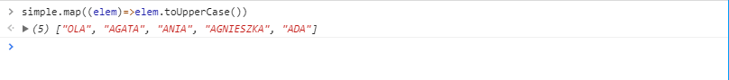
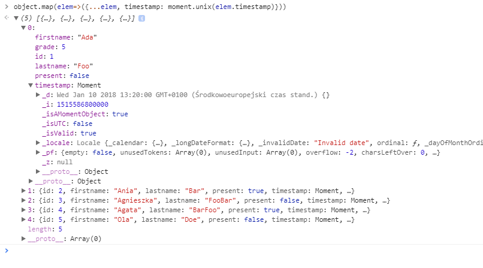
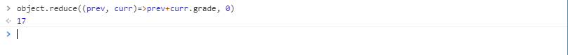
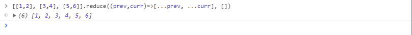
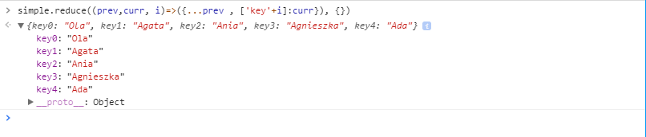
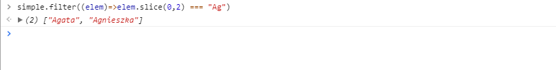
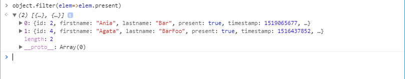
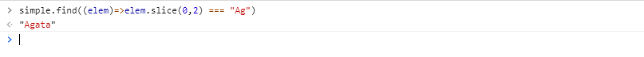
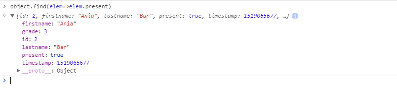

Można śmiało powiedzieć, że programiści Javascript lubią tablice a przynajmniej powinni. Bardzo często się z nimi spotykamy podczas pisania aplikacji webowych gdzie wyświetlamy dużo danych w różnych postaciach. Mamy na szczęście sporo metod które pomagają w codziennej pracy jednak początkujący może się w nich zgubić i nie wiedzieć jaką metodę użyć do danej sytuacji. Dziś chciałbym się pochylić na niektórymi  nich wraz z wyjaśnieniem i przykładem użycia.

<!--more-->

## Przykładowe tablice

Żeby łatwiej pokazać na czym polega różnica pomiędzy funkcjami operującymi na tablicach będę każdą z nich przeprowadzał na dwóch tablicach: prostą - przechowującą zwykłe stringi oraz na tablicy przykładowych obiektów. Tablice będą wyglądały następująco: 
```
const simple = ['Ola', 'Agata', 'Ania', 'Agnieszka', 'Ada']

```

```
const object = [
	{id:1, firstname:'Ada', lastname:'Foo', present: false, timestamp: 1515586800, grade: 5},
	{id:2, firstname:'Ania', lastname:'Bar', present: true, timestamp: 1519065677, grade: 3 },
	{id:3, firstname:'Agnieszka', lastname:'FooBar', present: false, timestamp: 1518267600, grade: 3},
	{id:4, firstname:'Agata', lastname:'BarFoo', present: true, timestamp: 1516437852, grade: 4},
	{id:5, firstname:'Ola', lastname:'Doe', present: false, timestamp: 1518630905, grade: 2}
]

```
Zanim przejdę do samych funkcji warto wspomnieć, że wszystkie te funkcje są czyste. Oznacza to, że nie zmieniają one oryginalnej tablicy tylko zwracają nową z przetworzonym wynikiem (lub pojedynczą wartość w przypadku niektórych). Jest to warte zapamiętania ponieważ na przykład Redux nie pozwala na mutowanie danych co sprawia, że nie możemy użyć niektórych operacji.  

## Map

Jest to jedna z częściej używanych ostatnio przeze mnie funkcji i do tego jedna z ulubionych. Jak się ją pozna i zrozumie widać w ilu miejscach ją można wykorzystać. Najprościej mówiąc `map` bierze oryginalną tablicę, wykonuję pewną operację na każdym z jej elementów i zwraca nową tablicę. Jak wspomniałem we wstępie jest to czysta metoda więc stara tablica jest nienaruszona. Metoda `map` wygląda następująco: 

```
Tablica.map((element, index, array)=>{
	//ciało funkcji
})

```
Tak naprawdę metoda przyjmuje jednej argument - funkcję, która będzie operowała na elementach tablicy. Może ona przyjmować 3 argumenty z czego większość ma tylko jeden lub dwa, jeszcze nie widziałem wykorzystania 3 elementu. Pierwszy argument - `element` jest to pojedynczy element tablicy na której teraz będzie funkcja operować, `index` jest to indeks tego elementu w tablicy (oczywiście numerując od 0), natomiast `array` jest to oryginalna tablica, którą potraktowaliśmy funkcją map. 

Przy tworzeniu funkcji należy pamiętać o zwróceniu wartości ponieważ dopiero ta zostanie wpisana do nowej tablicy.

Jakie może być zastosowanie tego? Możemy tą metodę wykorzystać jeśli chcemy zmienić postać wszystkich naszych danych na inną która aktualnie jest nam potrzebna np.: kapitalizacja imion bo akurat grafik uznał, że tak będzie ładnie wyglądało na stronie a my mamy dane zapisane normalnie 

```
simple.map((elem)=>elem.toUpperCase())

```


Inny przykład który ja ostatnio wykorzystuję to zamiana timestamp'a który otrzymuję z backendu na obiekt moment, którym jestem w stanie potem dalej manipulować. 

```
object.map(elem=>({...elem, timestamp: moment.unix(elem.timestamp)}))

```


Innym przykładem zastosowania tym razem z podwórka Reacta jest wyświetlenie danych z tablicy jako pojedyncze komponenty. Mam na myśli sytuacje gdzie mamy listę użytkowników, komponent do wyświetlenia jednego użytkownika i chcemy w prosty sposób wyświetlić całą listę

```
Object.map((elem)=><SingleProfil profil={elem} key={elem.id}/>)

```

## Reduce

Kolejna funkcja o mało mówiącej nazwie na początku która potrafi być przydatna. Czasami można znaleźć informację, że funkcja ta sprowadza tablice to pojedynczej wartości.  Jest to prawda ale nie tylko. Przy pomocy `reduce` możemy zrobić parę innych ciekawych rzeczy ale to za chwilę. `Reduce` wygląda następująco: 

```
Tablica.reduce((previous, current, index, array)=>{
	//ciało funkcji
}, initialValue)

```
Podobnie jak map `reduce` przyjmuje jako pierwszy argument funkcję, która przyjmuje jednak trochę inne argumenty. `Previous` jest to wartość wypracowana na podstawie poprzednich przebiegów natomiast 'current' jest aktualnym elementem tablicy. Dwa następne argumenty są identyczne jak w poprzednio omawianej funkcji. Drugim argumentem `reduce` jest opcjonalna pierwsza wartość. Nie musimy jej podawać jednak gorąco do tego zachęcam. Nie powoduje to zwiększenia nakładu pracy a może uniknąć niektórych błędów (na przykład gdy wykonamy reduce na pustej tablicy).

 W momencie pierwszego przebiegu funkcji `previous` i `current` mogą przyjąć różne wartości: 

- Jeśli podamy wartość początkową to previous będzie jej równe natomiast current przyjmie wartość pierwszego elementu w tablicy
- Jeśli nie podamy wartości początkowe to previous będzie równe pierwszemu elementowi tablicy natomiat current drugiemu 

Równie podobnie jak w przypadku funkcji map trzeba pamiętać o zwróceniu wartości w funkcji dzięki czemu będzie ona dostępna w następnym przebiegu funkcji.

Bardzo często taką funkcję do wyliczenia pojedynczej wartości z danych przechowanych w tablicy

```
object.reduce((prev, curr)=>prev+curr.grade, 0)
```


Inny sposób wykorzystania tego to spłaszczenie tablicy: 

```
[[1,2], [3,4], [5,6]].reduce((prev,curr)=>[...prev, ...curr], [])

```


Możemy zamienić również naszą tablicę na obiekt o zadanych przez nas kluczach :

```
simple.reduce((prev,curr, i)=>({...prev , ['key'+i]:curr}), {})

```


## Filter

Dwie kolejne funkcje mają dużo więcej mówiące nazwy. Pierwsza z nich - `filter` służy(jak nazwa wskazuje) do filtrowania tablicy na podstawie podanych przez nas kryteriów. Ma ona następującą postać: 

```
Tablica.filter((element, index, array)=>{
	//ciało funkcji
})

```
Podobnie jak map nie modyfikuje ona tablicy tylko zwraca nową zawierającą elementy spełniający nasze warunki. Wygląda również identycznie jak pierwsza omawiana funkcja dlatego pozwolę sobie ominąć opis żeby uniknąć niepotrzebnego powtarzania się. Warte wspomnienia jest co musimy zwrócić w naszej funkcji. Musi być to wartość typu `boolean`, która określi czy aktualny element ma się znaleźć w nowej tablicy: `true` znajdzie się, `false` zostanie pominięty. 

W przypadku tej funkcji przypadki użycia wydają się oczywiste i od razu widoczne. Przykładem takiego użycia może być np.: wybranie wszytskich imion które zaczynają się na `Ag` czy też wybranie obiektów zawierających poszukiwaną przez nas właściwość

```
simple.filter((elem)=>elem.slice(0,2) === "Ag")
```


```
object.filter(elem=>elem.present)

```


## Find

No i na sam koniec funkcja, która jest w pewien sposób podobna do powyższej. Wygląda identycznie i muszą być spełnione ten sam warunek w kwestii funkcji filtrującej jednak zwraca ona pierwszy wynik który spełnia założone przez nas kryteria. Bardzo łatwo jest zauważyć różnicę jeśli zamienimy w funkcjach powyżej słówko filer na `find`

```
simple.find((elem)=>elem.slice(0,2) === "Ag")
```


```
object.find(elem=>elem.present)

```


Przypadki użycia widać od razu jak się spojrzy na przykłady. Stosujemy zawsze gdy jesteśmy pewni, że istnieje tylko jeden element spełniający warunek lub interesuje nas tylko znalezienie pierwszego wystąpienia a nie potrzebujemy kolejnych. W Redux'cie bardzo często stosowane przy aktualizacji list - jeśli użytkownik wykonał jakąś akcję na pojedynczym elemencie (wyedytował lub usunął) możemy użyć `find` by znaleźć ten element i zmienić tylko jego stan. 


Oczywiście nie są to wszystkie funkcje jakie mamy dostępne w Javascript do operowania na tablicach jednak według mnie to są najczęściej spotykane i wykorzystywane. Nie są one również bardzo proste i wielu początkujących nie zdaje sobie sprawy z ich istnienia lub nie wiedzą kiedy mogą to wykorzystać. Mam nadzieję, że po tym wpisie będzie to przynajmniej minimalnie prostsze. A może uważacie, że coś pominąłem i powinno się znaleźć na liście. Jeśli tak to dajcie znać w komentarzu jakie są wasze ulubione metody i gdzie je stosujecie.

