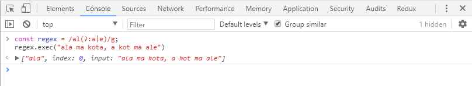
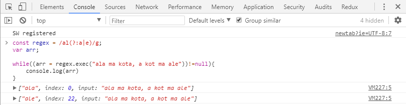
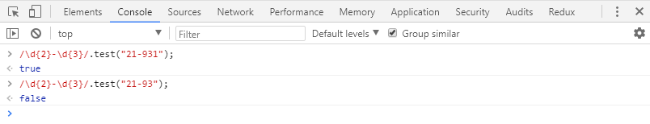
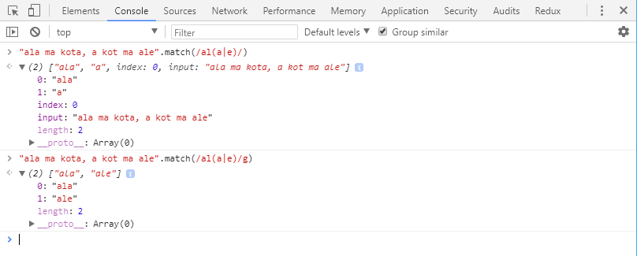
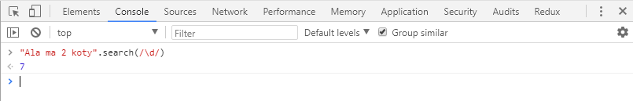
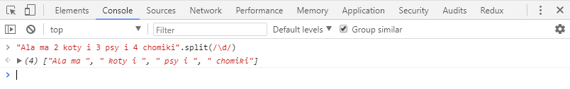
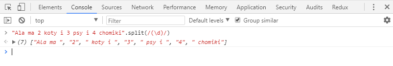
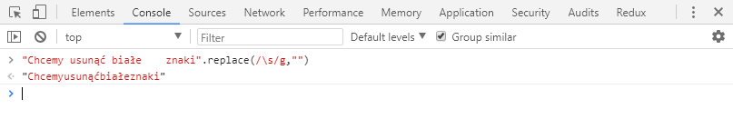
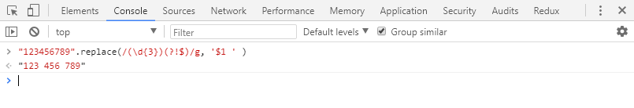

Javascript jak wszystkie inne języki programowania pozwala na obsługę wyrażeń regularnych. Możemy przy pomocy odpowiednich funkcji testować czy nasz string spełnia pewne założenia a nawet modyfikować pewne jego części. Dziś o tym jakie mamy funkcje w Javascript, które korzystają z wyrażeń regularnych oraz jak je można wykorzystać

<!--more-->

Dzisiejszy post jest bezpośrednią kontynuacją postu dotyczącego podstaw wyrażeń regularnych, który znajdziecie [tutaj](https://fsgeek.pl/post/w-swiecie-wyrazen-regularnych/). Jeśli nie wiecie co to są wyrażenia regularne i jak je definiować to proponuję zacząć czytać od poprzedniego postu a potem wrócić do tego. 

## Definiowanie wyrażeń regularnych w Javascript

W JavaScriptcie wyrażenie regularne są traktowane jako obiekty a nie stringi. Dlatego nie zapisujemy ich podczas deklaracji w apostrofach. Mamy możliwość zdefiniowania naszego wyrażenia w dwojaki sposób: tak jak się go standardowo zapisuje czyli np.: `/ala/g` lub tez przy pomocy funkcji `RegExp(wyrażenie, flaga)` np.: `const a = RegExp('ala','g')`. Nie ma różnicy co wybierzemy ponieważ obiekt jaki zwróci funkcja jest identyczny do tego zadeklarowanego w tradycyjny sposób. 

## Exec

Jako pierwsza będzie prosta metoda `exp`, która zwraca pierwszy pasujący zbiór znaków do naszego wzorca. Ma składnię `regexp.exp(str)`, gdzie `regexp` to nasze wyrażenie regularne, natomiast `str` string, który testujemy 

Jak widać pomimo tego, że w naszym testowanym stringu do wyrażenia pasują dwa ciągi znaków to zwrócił tylko jeden. Aby pobrać resztę musimy wykonać naszą funkcję `exp` w pętli `while` co sprawi, że zwróci wszystko. 

Jednak trzeba uważać - jeśli nasze wyrażenie nie zawiera flagi `g` spowoduje to powstanie nieskończonej pętli. Jeśli potrzebujemy znaleźć pasujące teksty to lepiej wykorzystać funkcję `match` o której będzie niżej. Ale jeśli potrzebujemy tylko znaleźć pierwsze pasujące wystąpienie lub potrzebujemy informacji na temat znalezionych grup wewnątrz wyrażenia jeśli wykorzystujemy flagę `g` to wtedy ta metoda jest lepsza.

## Test

Metoda `test` sprawdza czy w tekście, który podamy jako parametr znajduje się nasz wzorzec. Funkcja zwraca tylko wartość `true` - jeśli wzorzec zostanie znaleziony lub `false` gdy nie. Warto to stosować gdy chcemy na przykład zwalidować nasz string czy spełnia określone przez nas kryteria np. kod pocztowy

## Match

Poprzednie dwie funkcje wykonywały się na wyrażeniu regularnym i jako argument przyjmowały tekst. Od teraz będzie na odwrót - czyli funkcję wykonujemy na stringu a przekazujemy jako argument regex'a. Jako pierwszą wybrałem funkcję, która ma podobne działanie do exec'a. Zwraca wszystkie pasujące do wzorca kawałki tekstu jednak jeśli mamy flagę `g` to ignoruje łapanie grup - jeśli potrzebujemy tej funkcjonalności musimy użyć `exec`

## Search

Funkcja `search` jest podobna do wyżej opisanej `test`.  Sprawdza czy w naszym stringu znajduje się zdefiniowany przez nas wzorzec. Jeśli tak to zwraca jego indeks. Jeśli w stringu znajduje się więcej części pasujących do wzorca to jest zwracany indeks pierwszego wystąpienia. W przypadku niepowodzenia szukania jest zwracana wartość -1.

## Split

`Split` pozwala nam na podzielenie stringa na tabelę. W funkcji podajemy jako argument separator, który rozdzieli string na pojedyncze elementy. Nie musi to być  wyrażenie regularne ale mamy też taką opcję. Dzięki wykorzystaniu ich możemy konstruować bardziej zaawansowane warunki, które podzielą string na tablicę pojedynczych elementów. 
 

W tym przykładzie jako separator będzie traktowany każdy znak który jest cyfrą. Możemy również sprawić by separator trafił do wynikowej tablicy razem z pozostałymi elementami - aby to zrobić musimy użyć na naszym wyrażeniu grupowania

## Replace

No i na sam koniec funkcja, którą najbardziej lubię czyli `replace`. Podstawowym zastosowaniem jest zastępowanie lub usuwanie pewnych znaków z naszego tekstu np.: wszystkich białych (spacje, tabulacje itd):

Ale na tym się nie kończą możliwości. Możemy również edytować nasz string żeby przedstawić go w innej postaci niż potrzebujemy np.: sformatowanie numeru telefonu tak by po każdych 3 liczbach była spacja. Aby to zrobić możemy wykorzystać mechanizm zmiennych w funkcji replace. Zmiennych mamy tyle ile zdefiniowaliśmy grup w wyrażeniu i możemy je wykorzystywać do modyfikacji naszego tekstu

W tym przypadku chcemy znaleźć każdą grupę 3 cyfr(oprócz tej ostatniej) i dzięki wyrażeniu `'$1 '` wstawienie po tej grupie znaku spacji(lub też czegokolwiek innego co potrzebujemy na widoku) i tak dla wszystkich grup. Jest to dla mnie bardzo czyste rozwiązanie i gorąco polecam do zastanowienia się podczas modyfikacji tekstu czy możemy użyć wyrażeń regularnych. 

