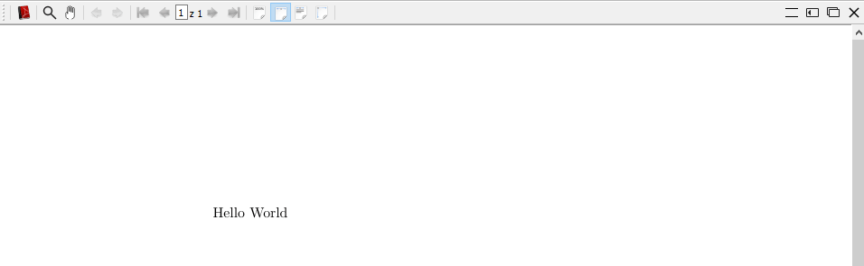
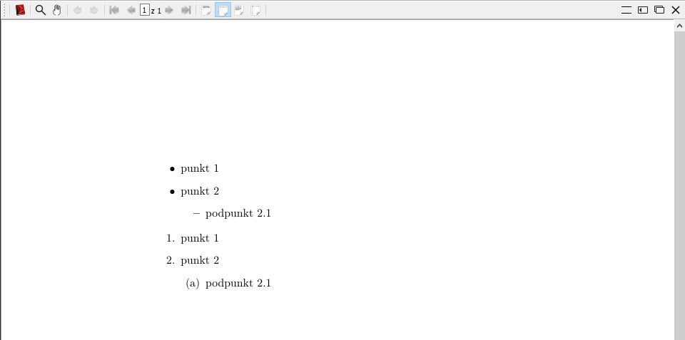
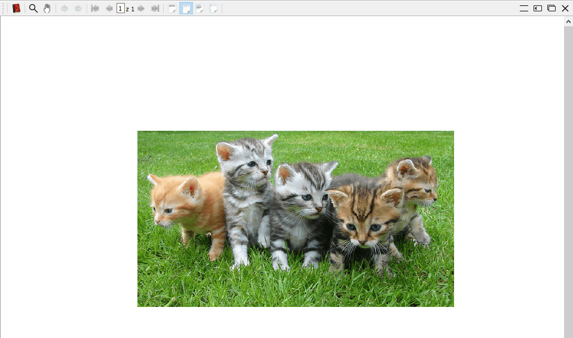
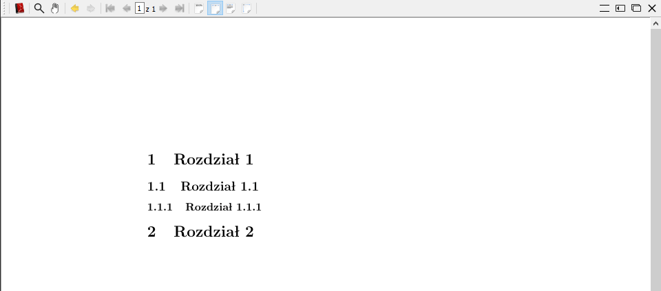
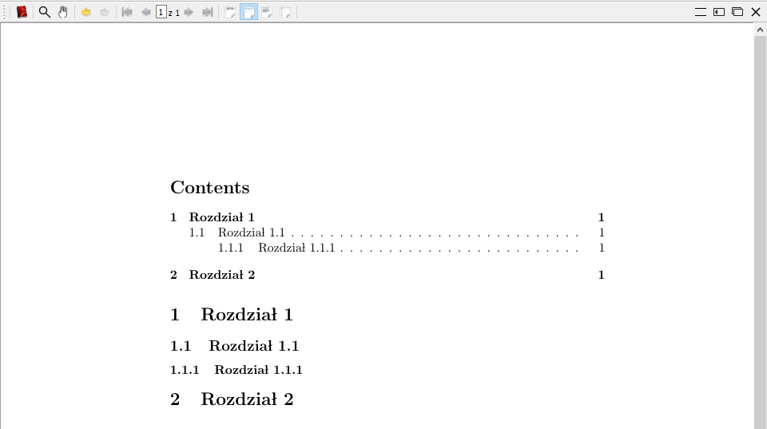
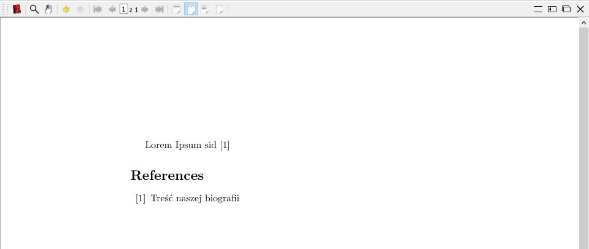
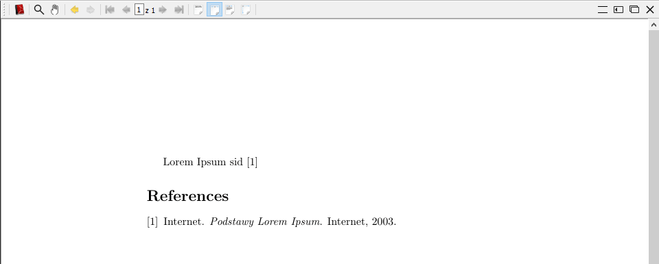

Każdy kto musiał pisać jakieś sprawozdanie, raport czy inną pracę pisemną wie, że formatowanie tekstu może być momentami uciążliwe. Wstawienie obrazka powoduje rozwalenie dokumentu w najmniej spodziewanej chwili a chwila nieuwagi powoduje, że punkty mają różne wcięcia. Czy da się skupić tylko na tekście i zapomnieć o formatowaniu mając nadzieję, że zrobi się samo i do tego dobrze? Zapraszam do poznania LaTex'a.

<!--more-->

## Czym jest LaTex?
LaText jest językiem znaczników, które są zestawem makr dla języka TeX. TeX został stworzony na Uniwersytecie Stanforda przez amerykańskiego matematyka i informatyka Donalda Knutha. Nie był on zadowolony z wyglądu drugiej edycji jego książki - Sztuka Programowania, więc postanowił stworzyć własny system do składu tekstu. Aktualnie korzystamy już z 3 wersji tego języka i każdy kolejna aktualizacja jest oznaczana kolejnym rozwinięciem liczby PI (aktualna to 3.14159265 wydana w 12 stycznia 2014). Nowe wersje TeX'a nie zawierają żadnych nowych funkcjonalności tylko poprawki istniejących błędów. Jednak z racji tego, że język ten jest bardzo skomplikowany to częściej korzysta się z zestawu makr zwanych formatami z których najpopularniejszym jest tytułowy LaTeX.

Czytając o LaTeX'ie bardzo często można spotkać się z określeniem WYSIWYM (What you see is what you mean) w odróżnieniu od WYSIWIG(what you see is what you get) gdzie dostajemy dokładnie to co sobie wypracowaliśmy. W przypadku WYSIWYM dostajemy to co sobie w pewien sposób zażyczyliśmy. W LaTex'ie dokument składamy za pomocą specjalnych znaczników i dopiero kompilacja daje nam wynikowy dokument, który jest sformatowany wedle naszych życzeń. Dzięki temu nasz tekst jest zawsze sformatowany poprawnie i nie ma problemów, które znamy z Worda gdzie nieumiejętne wstawienie nowego obrazka powoduje, że cały tekst nam się rozjeżdża.

## Podstawy pisania w LaTex
Dlaczego więc nie jest to tak popularne jak powinno być? Myślę, że wielu ludzi odstrasza to, że muszą tekst w pewien sposób zaprogramować oraz to że nie widzą rezultatów od razu tylko muszą go skompilować co wiąże się z ryzykiem pojawienia się błędów. Chciałbym pokazać, że nie jest to takie ciężkie i wystarczy zaledwie parę linijek by mieć podstawowy dokument.

### Instalacja
Oczywiście zanim cokolwiek zrobimy musimy zainstalować zarówno oprogramowanie LaTeX oraz edytor do łatwiejszego pisania. To pierwsze możecie pobrać z tej [strony](https://www.latex-project.org/get/) - jako, że pracuję głównie na Windowsie to zdecyodwałem się na [MiKTeX](https://miktex.org/). Oprócz tego jako edytor wykrozystuję [TeXstudio](https://www.texstudio.org/). Póki co nie miałem z nim żadnych problemów i dodatkowo można go uruchomić na każdej platformie. Do jego plusów mogę zaliczyć to, że ma zarówno pasek narzędziowy gdzie możemy wyklikać opcję np.: wyrównanie do lewej czy wstawienie równania matematycznego ale również podpowiada komendy podczas normalnego pisania.

### Podstawowy dokument
Skoro mamy już wszystko przygotowane to możemy zacząć pisać. Wszystkie pliki mają rozszerzenie *.tex a podstawowy tekst wygląda następująco:

```latex
\documentclass[]{article}

\begin{document}
	Hello World
\end{document}

```

Jak widać nie ma tego dużo i jest to w pełni poprawny dokument, który się skompiluje i będzie wyglądał następująco: 



Od tego momentu możemy rozbudowywać nasz tekst o kolejne elementy sprawiając, że będzie coraz bardziej rozbudowany. Oto parę typowych elementów.

#### Punkty

Najprostszy element który możemy umieścić w naszym tekście to lista z punktami : 

```latex
	\begin{itemize}
		\item punkt 1
		\item punkt 2
		\begin{itemize}
			\item podpunkt 2.1
		\end{itemize}
	\end{itemize}

	\begin{enumerate}
		\item punkt 1
		\item punkt 2
		\begin{enumerate}
			\item podpunkt 2.1
		\end{itemize}
	\end{enumerate}
```

Jak widać listę tworzymy przy pomocy znaczników `\begin` i `\end`. Przy znaczniku begin musimy podać typ listy jakiej będziemy używać - `itemize` dla zwykłych punktów oraz `enumerate` dla numerowanych. Potem jest już prosto ponieważ każdy kolejny punkt zaczynamy od znacznika `\item`. Możemy również umieszczać tam kolejne listy a LaTeX sam zadba by wyróżnić kolejne poziomy.



#### Obrazek

Kolejna rzecz często dodawana do różnych tekstów to obrazki. Aby móc je wstawiać musimy skorzystać z dodatkowego pakietu o nazwie `graphicx`. Aby dodać pakiet do naszego tekstu skorzystamy z polecenia `\usepackage{graphicx}`. W ten sposób możemy dodawać inne pakiety do naszego tekstu np.: `polski`, `hyperref` itd. Następny krok to podanie ścieżki gdzie będą nasze obrazki: `\graphicspath{ {./} }` - tutaj możemy podać ścieżkę zarówno względną jak i bezwględną. Teraz możemy wstawić nasz obrazek - całość kodu wygląda tak: 


```latex
\documentclass[]{article}
\usepackage{graphicx}

\graphicspath{ {./} }
\begin{document}
	\includegraphics[width=\textwidth]{image}
\end{document}
```

W nawiasach kwadratowych znajdują się dodatkowe ustawienia o których dziś nie będę pisał - tutaj wymuszam skalowanie obrazka tak by jego szerokość była identyczna jak szerokość naszego tekstu. Skompilowany dokument wygląda teraz tak:



#### Rozdziały

Teraz coś co jest może mniej popularne ale przydaje się w momencie gdy mamy dużo tekstu i chcemy go podzielić na mniejsze części. Rozdziały tworzymy wykorzystując grupę znaczników `section`. Dlaczego tym razem jest grupa znaczników a nie możliwość zagnieżdżania jak w przypadku list? Nie używamy tutaj sekcji begin-end więc nie byłoby wiadomo gdzie się kończy sekcja a gdzie zaczyna kolejna. Zamiast tego mamy grupę 3 znaczników gdzie każdy reprezentuje inny poziom w tekście

```latex
\documentclass[]{article}

\begin{document}
	\section{Rozdział 1}
		\subsection{Rozdział 1.1}
			\subsubsection{Rozdział 1.1.1}
	\section{Rozdział 2}
\end{document}

```



Mając już coś takiego bardzo prosto jesteśmy w stanie stworzyć spis treści - wystarczy dodać `\tableofcontents` na początku dokumentu i dostaniemy ładnie sformatowany spis treści:

```latex
\documentclass[]{article}


\begin{document}
	\tableofcontents
	\section{Rozdział 1}
		\subsection{Rozdział 1.1}
			\subsubsection{Rozdział 1.1.1}
	\section{Rozdział 2}
\end{document}
```



Czasami może być wymagane by dwa razy skompilować plik aby była poprawna numeracja stron.

#### Bibliografia

Na sam koniec coś z czego rzadko korzystamy chyba, że piszemy większą pracę czyli bibliografia. Warto wtedy mieć możliwość prostego tworzenia bibliografii i zarządzania nią. Możemy to zrobić w dwojaki sposób - pierwszy opiera się na samodzielnym składzie bibliografii natomiast drugi pozwala na większą automatyzację. Zacznę od pierwszego sposobu a potem pokażę jak przejść do drugiego. Pierwsze co musimy zrobić to stworzyć sekcję w której będzie wyświetlona nasza bibliografia. Ponownie wykorzystamy znaczniki `begin` i `end` tak jak w przypadku listy tylko podamy inną wartość 

```latex
\begin{thebibliography}{99}
	\bibitem{lorem} Treść naszej biografii
\end{thebibliography}
```

Liczba 99 oznacza maksymalną liczbę pozycji jakie stworzymy. Aby stworzyć pozycję w bibliografii wykorzystamy znacznik `\bibitem{krótka_nazwa}` po którym wpisujemy jak ma wygląd wpis. Ważne aby pamiętać, że tutaj to my dbamy o to jak wygląda nasza pozycji i musimy sami ją ostylować. Aby użyć teraz takiej pozycji musimy w dowolnym miejscu tekstu wykorzystać znacznik `\cite{nazwa_pozycji}`

```latex
\documentclass[]{article}

\begin{document}
	Lorem Ipsum sid \cite{lorem}
	
	\begin{thebibliography}{99}
		\bibitem{lorem} Treść naszej biografii
	\end{thebibliography}
\end{document}
```



Problem z taką bibliografią pojawia się w momencie gdy mamy jej dużo. Wtedy może się okazać, że zarządzanie nią, pilnowanie styli jest uciążliwe. Wtedy najlepiej skorzystać z dodatkowego narzędzia np.: BibTeX. Aby z niego skorzystać nie musimy nic dodatkowego robić ponieważ aktualnie każda dystrybucja TeX'a je zawiera a korzystanie z niej jest proste. Pierwsze co musimy zrobić to stworzyć nowy plik o rozszerzeniu *.bib. To w nim będziemy przechowywać nasze pozycje.  Jednak nasze wpisy w niczym nie przypominają tych poprzednich. Teraz wyglądają bardziej jak obiekty 

```latex
@Book{lorem,
	author = {Internet},
	title = {Podstawy Lorem Ipsum},
	year = {2003},
	publisher = {Internet},
}
```

Dzięki takiemu rozwiązaniu narzędzie jest w stanie samodzielnie złożyć wpis i odpowiednio ostylować - mamy pewność, że wszystkie wpisy tego samego typu będą wyglądały identycznie. Zostało tylko umieścić to w naszym tekście - wystarczy ze zamienimy naszą sekcję begin-end tymi znacznikami: 

```latex
\bibliography{nazwa_pliku}
\bibliographystyle{nazwa_stylu}
```


```latex
\documentclass[]{article}

\begin{document}
	Lorem Ipsum sid \cite{lorem}
	
	\bibliography{bib}
	\bibliographystyle{plain}
\end{document}

```



Jak widać LaTeX nie jest skomplikowany. Wystarczy nam parę poleceń by stworzyc podstawowy szkielet naszego dokumentu, który potem możemy rozbudowywać kolejnymi poleceniami lub konfiguracją. Aktualnie jestem na etapie pisania inżynierki z jego pomocą i jestem póki co bardzo zadowolony. Taki sposób pisania pozwala mi się w pełni skupić na treści pozostawiająć część związaną z formatowaniem odpowiednim skryptom - po pierwsze zrobią to lepiej a po drugie nie muszę się nad tym denerowować. Polecam spróbować i zobaczyć czy będzie odpowiednie do waszych zastosowań.