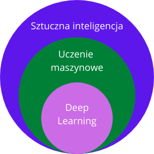

Sztuczna inteligencja w ostatnich latach stała się pojęciem modnym i często nadużywanym. Jedną z dziedzin sztucznej inteligencji jest uczenie maszynowe, które umożliwia tworzenie systemów uczących się na podstawie danych i następnie wykorzystujących tę wiedzę. Na czym to polega, po co nam to i jak możemy podzielić uczenie maszynowe?

<!--more-->

## Skąd się to wzięło?

Jeśli myślicie, że uczenie maszynowe jest współczesnym wynalazkiem to jesteście w błędzie. Pierwsze próby tworzenia takich systemów można się doszukiwać w latach 50 ubiegłego wieku. Dlaczego więc dopiero w ostatnich latach widać wzrost popularności tego tematu? Jest to związanie z kilkoma czynnikami. Po pierwsze dysponujemy mocniejszymi komputerami, które są w stanie przetworzyć duże ilości danych i dać akceptowalne wyniki. No i najważniejsze — dysponujemy teraz sporymi ilościami danych, które możemy użyć w procesie uczenia. Bez tych danych systemy nie byłyby w stanie nauczyć się lub nauczyłyby się błędnie. A to by sprawiło, że byłyby bezużyteczne.

## Uczenie maszynowe

Uczenie maszynowe można określić jako proces zdobywania wiedzy w danej dziedzinie przez algorytm przy wykorzystaniu i analizie dostarczonych mu w trakcie nauki danych. Uczenie maszynowe sprawdza się wszędzie tam, gdzie nie dysponujemy algorytmami pozwalającymi rozwiązać problem, natomiast posiadamy zbiór danych opisującym problem. Innymi słowy, potrafimy stworzyć zbiór danych opisujących wejście oraz oczekiwany rezultat, natomiast nie potrafimy stworzyć analitycznie algorytmu, który przekształci te dane z wejścia na wyjście. Znalezione wzorce mogą nie opisywać badanego procesu całkowicie, tylko będą stanowiły jego pewne przybliżenie. Możemy tym przybliżeniem sterować przy pomocy rozmiaru danych, na jakich operujemy, oraz metodą uczenia, tak by błąd wynikający z przybliżenia był akceptowalny dla danego zastosowania.

## Uczenie maszynowe vs sztuczna inteligencja

Sztuczna inteligencja jest działem informatyki, która ma pozwolić stworzyć systemy uczące się inteligentnych zachowań. Systemy te dzięki interpretowaniu danych, uczeniu się oraz wykorzystywaniu tej wiedzy mają podejmować decyzje oraz być elastyczne. Przykładem testu, który sprawdza "inteligencję" systemu jest test Turinga, który sprawdza zdolność systemu do posługiwania się językiem naturalnym. A jak się to ma do uczenia maszynowego? Sztuczna inteligencja jest działem o wiele większym i dotykającym wiele różnych dziedzin niż tylko uczenie maszynowe, co idealnie widać na obrazku.

## Podział uczenia maszynowego

Z racji tego, że jest to temat całkiem nieźle zbadany (przynajmniej akademicko), to możemy wyróżnić kilka rodzajów uczenia maszynowego: 

- uczenie nadzorowane (eng.: supervised learning)
- uczenie nienadzorowane (eng.: unsupervised learning)
- uczenie półnadzorowane (eng. semi-supervised learning)
- uczenie ze wzmocnieniem (eng.: reinforcement learning)

Uczenie nadzorowane wymaga początkowej fazy uczenia (treningu), gdzie dostarczamy oetykietowane dane. Dzięki etykietom system potrafi nauczyć się rozpoznawać wzorce i następnie wykorzystać wiedzę do nowych danych.

Uczenie nienadzorowane nie potrzebuje fazy uczenia (lub też dane nie posiadają etykiet) i potrafi wyciągać wnioski na podstawie samych danych.

Uczenie półnadzorowane znajduje się pomiędzy wyżej wspomnianymi. Mamy tam do czynienia z małą ilością oetykietowanych danych oraz dużą ilością nieposiadających etykiet.

No i na sam koniec uczenie ze wzmocnieniem, które posiada zupełnie odmienną specyfikę. Nie mamy tutaj danych wejściowych, ale system otrzymuje informację zwrotną o wynikach. Pozwala to na zmianę zachowań systemu, tak by generować jak najlepsze rezultaty.

## Gdzie wykorzystujemy?

Może się wydawać, że systemy korzystające z takich zaawansowanych algorytmów nie są dostępne dla zwykłej osoby. Natomiast są one już obok nas i korzystamy z nich, nawet o tym nie wiedząc. Gdzie możemy je spotkać: 

- systemy do filtrowania spamu
- reklamy na fb, google
- systemy rekomendacji
- gry komputerowe
- asystenci głosowi
- face unlock

## Jak zacząć z uczeniem maszynowym?

Ciężko odpowiedzieć na to pytanie, ponieważ nie ma jednej sprawdzonej drogi. Z jednej strony uczenie maszynowe opiera się na matematyce i dużej ilości teorii. Jednak jest to zazwyczaj nudne i odstraszy większość osób. Według mnie dużo lepiej jest zacząć coś robić i stopniowo wszystko poznawać. Jeśli chcecie już zacząć coś robić, to sprawdźcie platformę Kaggle i konkurencję Titanic (do znalezienia [tutaj](https://www.kaggle.com/c/titanic)). Zachęcam również do dołączenia do nowej grupy na fb - [Uczenie maszynowe w Javascript](https://www.facebook.com/groups/366332021430977/). Będę tam wrzucał informacje dotyczące uczenia maszynowego (te dla początkujących, jak i bardziej zaawansowanych) oraz o kolejnych postach. Na pewno będę chciał rozwijać kolejne tematy od strony teoretycznej (ale z minimalną ilością matematyki) oraz praktycznie, czyli pisanie algorytmów i rozwiązywanie konkurencji na Kaggle. Pomimo tego, że w nazwie grupy jest Javascript, to będą też wrzucane materiały ogólne. Serdecznie zapraszam :)