Narzędzia CLI są bardzo powszechne w programowaniu. Spotkamy je na frontendzie (AngularCLI, VueCLI), backendzie (dotnet, phpspec), w powłoce linuksa i jego poleceniach oraz wielu różnych bibliotekach. A jak napisać własne CLI w Node.js, które pomoże nam w wykonywaniu naszych codziennych obowiązków? Dziś przegląd bibliotek, które mogą nam w tym pomóc.

<!--more-->

## Winston
W każdej aplikacji dobre logowanie informacji to podstawa - pozwala śledzić pracę systemu a w razie wystąpienia błędów umożliwia szybką naprawę. W Node.js do tego celu możemy wykorzystać wbudowane polecenie `console.log` lub jeśli potrzebujemy bardziej zaawansowane narzędzie to bibliotekę [Winston](https://github.com/winstonjs/winston). Aby uruchomić logowanie informacji w podstawowej formie potrzebujemy zdefiniować przynajmniej jedno miejsce gdzie będą one składowane np.: konsola (w tym przypadku będą tylko wyświetlone).
```
const winston = require('winston')

const logger = winston.createLogger({
    transports: [
        new winston.transports.Console({})
    ]
})
```

Teraz żeby to wykorzystać musimy tylko wywołać naszą zainicjowaną zmienną wraz z podaniem poziomu ważności naszej informacji


```
logger.error('error');
logger.info('info');

```
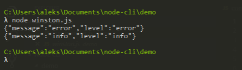

Możemy również rozbudować naszą konfigurację tak aby dodać kolorowanie, zmienić format lub dodać inne miejsca zapisu np.: do pliku, co pozwoli zachowywać te informacje na później
```
const logger = winston.createLogger({
    transports: [
        new winston.transports.Console({
            format: winston.format.combine(
                winston.format.colorize(),
                winston.format.simple()
              )
        }),
          new winston.transports.File({
            filename: 'error.log',
            level: 'error'
          }),
      ],
})
```
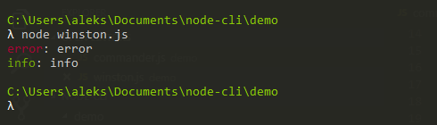

Oczywiście możliwości Winstona są dużo większe i postaram się je opisać dokładnie w osobnych wpisach.
  
## Inquirer.js
To co najlepsze w każdym narzędziu CLI to możliwość dobierania parametrów do naszych potrzeb. Chodzi mi tutaj o sytuację gdzie narzędzie odpytuje nas o kolejne parametry a my dla każdego jesteśmy w stanie wybrać pasującą dla nas opcję np.: wybór biblioteki do testowania. Aby dać użytkownikom taką funkcjonalność najlepiej skorzystać z biblioteki [inquirer](https://github.com/SBoudrias/Inquirer.js). Daje nam ona dostęp do różnych typów pytań, które możemy zadać użytkownikowi oraz zwraca nam podane odpowiedzi. Wykorzystanie biblioteki wygląda następująco: 

```
const inquirer = require("inquirer");


inquirer.prompt([
{
    type: 'input',
    name: 'name',
    message: 'Provide name',
    default: 'Foo'
},
{
    type: 'list',
    name: 'mainLanguages',
    message: 'Main languages',
    default: 0,
    choices: ['javascript', 'php', 'go', 'c#']
},
{
    type: 'checkbox',
    name: 'knownLanguages',
    message: 'Known languages',
    choices: ['javascript', 'php', 'go', 'c#']
},
{
    type: 'confirm',
    name: 'ok',
    message: 'Everything ok',
},
]).then(console.log)
```

W przykładzie podałem 4 typy pytań, które możemy wykorzystać:

 - `input` - zwykłe zapytanie i zwykła odpowiedź, 
 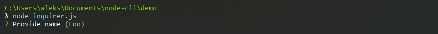
 - `list`- dajemy listę możliwych wartości i użytkownik wybiera jedną, 
 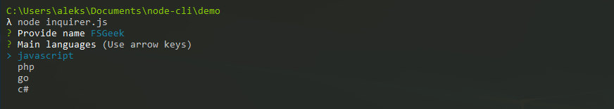
 - `checkbox` - dajemy listę możliwości ale teraz użytkownik może wybrać więcej wartości 
 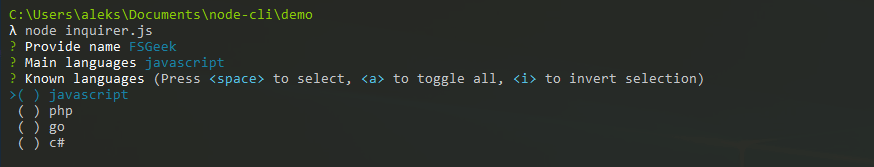
 - `confirm`, który służy do odpowiedzi tak lub nie.
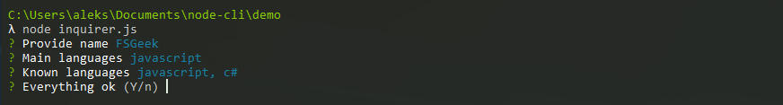

Na samym końcu dostajemy obiekt, którego klucze to pola `name` z naszej konfiguracji natomiast wartościami są odpowiedzi podane przez użytkownika.

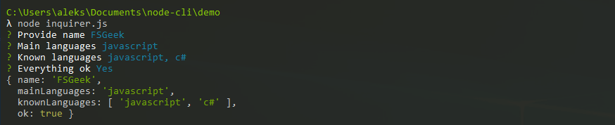

## commander.js
Nie byłoby narzędzia konsolowego bez możliwości sterowania jego pracą przy pomocy przełączników. Możemy to obsłużyć przy pomocy zmiennej globalnej `process.argv` lub skorzystać z biblioteki [commander](https://github.com/tj/commander.js), która nam w tym pomoże.  Wykorzystanie tej biblioteki ogranicza się do określenia jakie przełączniki chcemy mieć w swojej aplikacji oraz ich obsłużeniu 

```
const commander = require('commander');


commander
    .version('0.0.1')
    .option('-g, --generate-raport')
    .option('-n, --name [name]')
    .parse(process.argv)

console.log(commander.name)
console.log(commander.generateRaport)
```

Dodatkowo, bez pisania dodatkowego kodu dostajemy przełącznik `--help`, który wyświetli wszystkie możliwe przełączniki wraz z opisem (o ile go utworzyliśmy)

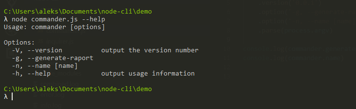

## chalk
Przy tworzeniu wszelakich narzędzi warto zadbać o to by oprócz poprawnego działania również wyglądały zachęcająco dla użytkowników. W przypadku narzędzi CLI nie mamy dużego pola do popisu ponieważ możemy tylko operować na tekście. W Node.js do jego manipulacji możemy wykorzystać bibliotekę [chalk](https://github.com/chalk/chalk). Pozwala na formatowanie tekstu, zmienę jego koloru oraz koloru tła - czyli wszytsko czego potrzebujemy. Do tego korzystanie z niej jest banalnie proste

```
const chalk = require('chalk');


console.log(chalk.red('Red'))
console.log(chalk.white.bgBlue.underline('Red'))
console.log(chalk.rgb(20,100,50)('RGB'))
```

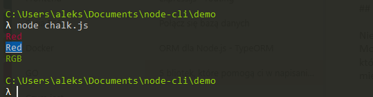

## listr

Ostatnia biblioteka pomaga nam zwizualizować użytkownikowi to co robimy w danym momencie. Po wykorzystaniu przełączników, wybraniu odpowiednich opcji przez użytkownika i zatwierdzeniu wszystkich wyborów nasze narzędzie musi wykonać to do czego zostało stworzone czyli automatycznie wykonać grupę czynności. W przypadku Node'a najczęściej będzie to instalacja dodatkowych pakietów npm, stworzenie nowych plików, skonfigurowanie bibliotek itd. Warto dawać wtedy użytkownikowi informacje na jakim jest etapie i czy wszystko poszło zgodnie z planem. Wykorzystanie biblioteki [listr](https://github.com/SamVerschueren/listr) pomaga nam to osiągnąć a wykorzystanie jej polega na zdefiniowaniu listy zadań oraz uruchomieniu jej

```
const Listr = require('listr');


const tasks  = new Listr([
    {
        title: 'Return value',
        task: ()=>'value'
    },
    {
        title: 'Return promise',
        task: ()=> new Promise((resolve, reject) => {
            setTimeout(()=>resolve('test'), 5000)
        })
    },
    {
        title: 'Return error',
        task: ()=>{
            throw new Error('error');
        }
    },
    {
        title: 'Return value after error',
        task: ()=>'value'
    },
])

tasks.run().catch(err => {
	console.error(err);
});
```

Zadaniami mogą być zwykłe funkcje, Promises, Observables i Streams - daje to dość dużo możliwości. W momencie gdy zadanie jest w trakcie realizacji to jesteśmy o tym informowani.

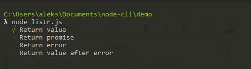

Tak samo w momencie gdy dostaniemy błąd to jest on wyświetlony a samo wykonywanie zadań przerwane.

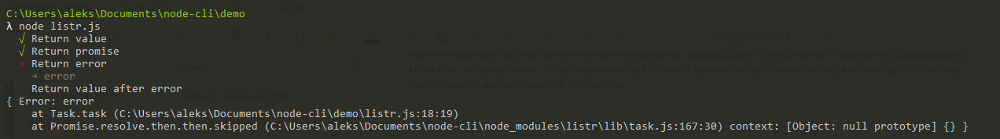

A wy macie swoje ulubione biblioteki, które byłyby przydatne przy pisaniu CLI? A może kiedyś już coś takiego pisaliście i macie swój ulubiony zestaw bibliotek? Zapraszam do komentowania i dzielenia się nimi. W końcu w świecie JavaScriptu codziennie powstają nowe biblioteki i łatwo przeoczyć te ciekawe ;) 