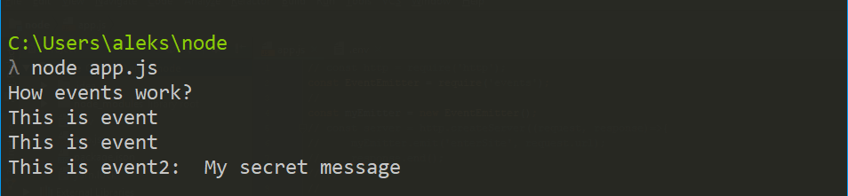
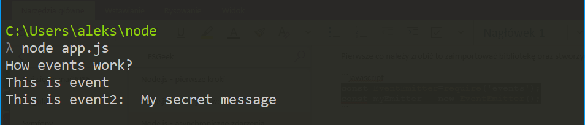
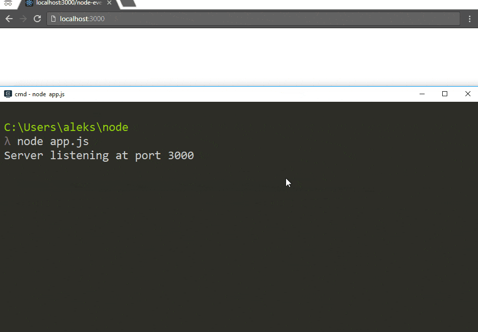

Czy zastanawialiście się kiedyś jak działa Messenger lub inny ulubiony czat? Jakim sposobem dostajecie powiadomienia na Facebooku mimo, że nie odświeżyliście strony? Jeśli odpowiedzieliście na któreś pytanie twierdząco to zapraszam do kolejnego wpisu z serii o Node.js gdzie poruszę kwestię asynchronicznych wydarzeń - jak je tworzyć oraz odbierać. Zapraszam również do poprzednich wpisów jeśli je ominęliście: [Pierwsze kroki w Node.js](https://fsgeek.pl/post/nodejs-pierwsze-kroki/) oraz [Jak napisać własny serwer](https://fsgeek.pl/post/node-jak-postawic-serwer/)
<!--more-->
## Node.js events

Tak jak wspomniałem we wstępie mechanizmem odpowiedzialnym za działanie czatu są tak zwane wydarzenia czyli events(po angielsku brzmi to jakoś lepiej). Mechanizm składa się z dwóch części: 

- Emmiter czyli źródło wydarzenia 
- Listener czyli nasłuchiwacz wydarzeń 

Zadaniem tego pierwszego jest tworzenie wydarzeń w systemie na wskutek jakieś sytuacji, która zaistniała. Może to być na przykład wysłanie nowej wiadomości, utworzenie postu, zmiana statusu itd. Natomiast Event Listener ma za zadanie nasłuchiwać czy wystąpiło wydarzenie, które może odebrać i zareagować na nie, zgodnie z wolą programisty czyli na przykład wyświetlić powiadomienie na stronie lub dodanie nowej wiadomości do okna czatu. Mechanizm jak się o nim mówi jest prosty jednak jak go zaimplementować?

## Jak zaimplementować obsługę wydarzeń? 

Do zaimplementowania prostego systemu, który będzie reagował na dziejące się wydarzenia możemy użyć biblioteki Events, która znajduje się w Node.js (tak więc podobnie jak http w poprzednim poście nie musimy nic instalować dodatkowo). Również na tym opierają się biblioteki takie jak [socket.io](https://github.com/socketio/socket.io) czy [websocket](https://github.com/websockets/ws), które obudowują go w swoje rozwiązania. Jednak ja dzisiaj się skupię na samej bibliotece Events, żeby pokazać jak to działa i zachęcić do samodzielnych zabaw.

Pierwsze co należy zrobić to zaimportować bibliotekę oraz stworzyć jej nową instancję.

```javascript
const EventEmitter=require('events');
const myEmitter = new EventEmitter();
```

Teraz przy pomocy zmiennej `myEmitter` jesteśmy w stanie zarówno wysyłać jak i odbierać wydarzenia w systemie. 

```javascript
myEmitter.on('event',()=>{
console.log(`This is event`)
})

myEmitter.on('event2',(message)=>{
console.log(`This is event2:${message}`)
})

myEmitter.emit('event');
myEmitter.emit('event');
myEmitter.emit('event2','My secret message');

```

Do tworzenia zdarzeń służy funkcja `emit`. Wysyła ona wydarzenie o określonej nazwie oraz opcjonalnie możemy przekazać dodatkowe dane, które chcemy by były odebrane. Żeby odebrać coś takiego potrzebujemy funkcję `on`, która przyjmuje dwa parametry:
	- pierwszy to jest nazwa wydarzenia na który funkcja ma zareagować
	- drugi jest to funkcja obsługująca wydarzenie, jako parametry przyjmuje dane przekazane przy emisji zdarzenia

Jak odpalimy to w konsoli zobaczymy następującą rzecz: 



Ładnie widać, że dwa razy pojawiło się zdanie `This is event`, ponieważ dwa razy wywołaliśmy wydarzenie o nazwie `event`. Jest to domyślne zachowanie dla funkcji nasłuchującej. Żeby reagować tylko na pierwsze wystąpienie danego wydarzenia możemy użyć funkcji `once`

```javascript
myEmitter.once('event',()=>{
console.log(`This is event`)
})
```

Teraz po odpaleniu tego samego kodu w konsoli zobaczymy coś takiego



## Wydarzenia na serwerze

Samo korzystanie z node events w konsoli nie jest porywające ale wiedząc jak to działa jesteśmy w stanie wykorzystać to w dowolnym innym miejscu. Możemy na przykład połączyć to z serwerem, który stworzyłem w poprzednim wpisie. 

```javascript
const http=require('http');
const EventEmitter=require('events');

const myEmitter=new EventEmitter();
const server=http.createServer((request,response)=>{
myEmitter.emit('enterSite',request.url);
response.end();
});

server.listen(3000);
console.log('Server listening at port 3000')

myEmitter.on('enterSite',(url)=>{
console.log(`user enter site:${url}`);
});

``` 
Można zobaczyć jak to działa w poniższym gifie. Każdy request jest rejestrowany i wysyłane jest odpowiednie wydarzenie, które loguje nam informacje w konsoli.



Jak widać jest to dosyć proste. Jednak podobnie jak w poście dotyczącym własnego serwera przy normalnej pracy korzystamy z gotowych bibliotek. Dlatego w następnym poście będę chciał stworzyć prosty chat przy wykorzystaniu jedenj z tych bibliotek. Jeśli jesteście ciekawi jak to zrobić nie zapomnijcie polajkować moją stronę na fb by nie przeoczyć następnego postu. I do usłyszenia :)