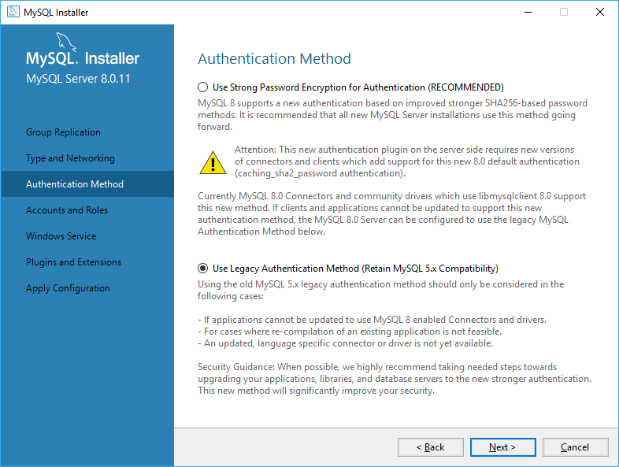
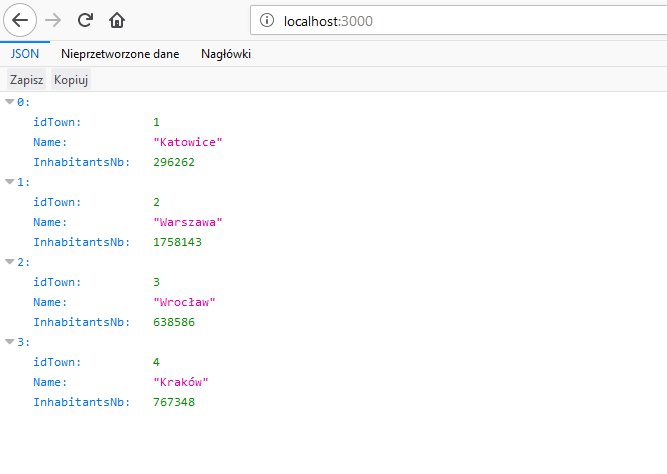
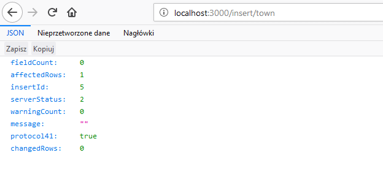

Backend wiele ważnych zadań do wykonania ale chyba najważniejszym zadaniem jest zapisywanie i wyciąganie informacji z bazy danych. Nieważne czy jest to zwykła baza SQL, Redis czy Elasticsearch potrzebujemy mieć miejsce do zapisywania informacji by ich nie stracić i móc wykorzystać póżniej. W każdym języku mamy dedykowane biblioteki, które pomagają nam w tym. Nie inaczej jest w Node.js, o którym dzisiaj piszę.

<!--more-->

## Baza danych MySQL
Na początek wybrałem chyba najpopularniejszą bazę danych od której chyba każdy zaczyna. Wspomina się o niej w technikum o profliu informatycznym czy też na studiach więc myślę, że większość programistów od niej zaczynała a już na pewno coś robiła. Aby zacząć najprościej jest pobrać instalator z tej [strony](https://dev.mysql.com/downloads/mysql/). Zainstaluje on lokalny serwer MySQL oraz narzędzie Workbench, które jest takim lepszym PHPMyAdmin ;). Co prawda warto umieć poruszać się w lini poleceń po bazie danych to czasami miło jest przeglądać bazę w takim narzędziu.

Zanim przejdziemy już do samego Node'a to chciałbym zwrócić uwagę na jedną opcję podczas instalacji serwera. Jak dojdziemy do opcji `Authenticathion Method` proponuję wybrać opcję `Use Legacy Authentication Method`



Jest to spowodowane tym że biblioteka, którą mam zamiar użyć jeszcze nie wspiera nowej metody autentykacji. Już się pojawił [PR](https://github.com/mysqljs/mysql/pull/1962), który to naprawia więc niedługo będzie można się przełączyć. 

## Połączenie z bazą danych w Nodzie

Jak wspomniałem chwilę temu będziemy wykorzystywać osobną bibliotekę do połączenia z bazą danych. Aby ją zainstalować wystarczy jedna komenda w konsoli: 

```console
yarn add mysql
``` 

Teraz pierwsza rzecz od jakiej musimy zacząć to zaimportowanie odpowiedniej biblioteki w naszym pliku *.js oraz stworzenie konfiguracji dla naszego połączenia z bazą. Konfiguracja wygląda identycznie do tego co można spotkać w innych językach/frameworkach backendowych czyli musimy podać: adres bazy danych, użytkownika, hasła i do jakiej bazy się podpinamy. Ja na potrzeby konfiguracji stworzyłem zwykły obiekt: 

```js
const config = {
    host     : 'localhost',
    user     : 'root',
    password : '',
    database : 'playground',
}

const connection = mysql.createConnection(config);
```

Mając konfigurację możemy stworzyć zmienną, która będzie nam służyła do komunikacji z bazą danych.
Polecany sposób to jest ręczne tworzenie połączenia i potem je zamykanie czyli wygląda to następująco: 

```js
connection.connect( err => {
    if(err) throw err;
});

app.all('/', (req, res)=>{
    connection.query("Select * from town", (err, result, fields)=>{
        if (err) throw err;
        res.setHeader('Content-Type', 'application/json');
        res.send(JSON.stringify(result));
    });
    
})

connection.end();
```


Wtedy rodzielamy w samo połączenie od query następuje później, co może ułatwić szukanie błędów w razie jakiś problemów. Ale jeśli nie chcemy tak robić to możemy opuścić metodę `connect ` ponieważ przy tworzeniu `query` połączenie i tak zostanie nawiązane więc kod powyżej można skrócić do następującego: 

```js

app.all('/', (req, res)=>{
    connection.query("Select * from town", (err, result, fields)=>{
        if (err) throw err;
        res.setHeader('Content-Type', 'application/json');
        res.send(JSON.stringify(result));
    });
    
})

```

Metoda query przyjmuje dwa parametry: pierwszy to zapytanie jakie chcemy skierować do naszej bazy, druga to funkcja która zostanie wywołana po zakończeniu przetwarzania naszego zapytania. Ważne jest by pamiętać że funkcja zostanie wywołana niezależnie czy zapytanie zakończy się sukcesem i dostaniemy wyniki czy też wystąpi błąd w trakcie.

Jeśli wszystko się udało to w zmiennej `result` będzie obiekt z wynikiem naszego zapytania, którym potem możemy dalej obsługiwać. Ja wykorzystałem framewrok `express` by zwrócić to w postaci JSON'a do przegladarki




## Przekazywanie parametrów do query

Oczywiście sytuacja gdzie mamy takiego prostego selecta zdarza się mega rzadko. Dużo częściej potrzebujemy bardziej zaawansowane kwerendy. Przykładem minimalnie trudniejszej kwerendy jest taka gdzie potrzebujemy wyciągnąć jeden rekord na podstawie jakiś kryteriów. Bardzo często jest to już wykorzystywane np.: przy logowaniu gdy potrzebujemy sprawdzić czy użytkownik wpisał poprawne hasło dla loginu. Pierwsza myśl jaka przyjdzie do głowy to jest użycie interpolacji stringa by wpisać odpowiednią wartość do zapytania. Coś takiego

```js
app.all('/:id', (req, res)=>{
    connection.query(`Select * from town where idTown=${req.params.id}`, (err, result, fields)=>{
        if (err) throw err;
        res.setHeader('Content-Type', 'application/json');
        res.send(JSON.stringify(result));
    });
    
})
```

Oczywiście tak jak tutaj to w niczym nie szkodzi tak NIGDY tego nie róbcie. Wystawiacie się w ten sposób na SQL Injection. Idealnym przykładem jest historyjka z [xkcd](https://xkcd.com/327/)


Dużo lepiej jest skorzystać z funkcji, które escapują nam to co wprowadził nasz użytkownik tak by nie zaszła sytuacja jak na obrazku. Mamy dwie opcje jak temu możemy zapobiec. Pierwsza to wykorzystanie metody `escape`

```js
app.all('/:id', (req, res)=>{
    connection.query(`Select * from town where idTown=${connection.escape(req.params.id)}`, (err, result, fields)=>{
        if (err) throw err;
        res.setHeader('Content-Type', 'application/json');
        res.send(JSON.stringify(result));
    });
    
})
```

Druga opcja to wykorzystanie znaków `?` tam gdzie chcemy umieścić nasze dane - zostaną one automatycznie wyescepowane. 

```js
app.all('/:id', (req, res)=>{
    connection.query(`Select * from town where idTown= ?`, [req.params.id], (err, result, fields)=>{
        if (err) throw err;
        res.setHeader('Content-Type', 'application/json');
        res.send(JSON.stringify(result));
    });
    
})
```


Dodatkowo przy takim wykorzystaniu takiego sposobu na escepowanie możemy w prosty sposób dodawać nowe rekordy do tabeli przekazując odpowiednio spreparowany obiekt. 

```js
const newTown = {
    Name: 'NewTown',
    InhabitantsNb: 12345
};

app.all('/insert/town', (req, res)=>{ 
    const a = connection.query('Insert into town set ?', newTown, (err, result, fields)=>{
        if (err) throw err;
        res.setHeader('Content-Type', 'application/json');
        res.send(JSON.stringify(result));
    });
})
```

Obiekt musi mieć pola o identycznych nazwach jak w tabeli. Dzięki temu to zapytanie będzie wyglądało w ten sposób: 

```mysql
Insert into town set `Name` = 'NewTown', `InhabitantsNb` = 12345
```

Jak już jesteśmy przy wstawianiu nowych rekordów to gdy to zapytanie się uda to również dostaniemy obiekt w zmiennej. Co prawda nie będzie to nowowstawiony rekord ale informacje, które mogą być przydatne np.: id nowego rekordu. Cały obiekt prezentuje się następująco: 



Trochę tego wyszło ale nie jest to skomplikowane i w ciągu 1h jesteśmy w stanie swobodnie poruszać się w tej bibliotece i komunikować się z bazą danych. Oczywiście na MySQL się świat nie kończy i tak jak wspominałem istnieje wiele innych rozwiązań, które pozwalają na przechowywanie danych. Jest coś o czym byście chcieli przeczytać? Dajcie znać w komentarzach ;) 

