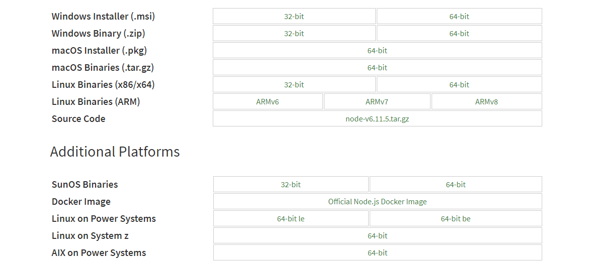

Dużo ludzi kojarzy JavaScript tylko z przeglądarkami i ogólnie pojętym frontendem. Jednak na tym nie kończą się możliwości tego języka. Dzięki Node.js mamy możliwość napisać w Javascriptcie funkcjonalny serwer dla naszych aplikacji. I co najważniejsze nie jest to trudne.
<!--more-->
## Czym jest Node.js? 

Jest to platforma zbudowana na Chrome V8. Jest to darmowy silnik Javascript stworzony przez Google'a w języku C++ i używany oprócz Node'a także w przeglądarce Chrome. Dzięki temu nie potrzebujemy przeglądarki by odpalić nasz kod Javascript a jesteśmy w stanie to zrobić wszędzie tam gdzie jesteśmy w stanie zainstalować Node'a. A wedle oficjalnej dokumentacji jesteśmy w stanie to zrobić na naprawdę dużej ilości środowisk



Jak widać jest tego sporo. Warte zauważenia są binarki dostępne dla systemów opartych o ARM. Dzięki temu mamy możliwość postawienia własnego serwera między innymi na raspberry pi (co kiedyś opiszę na blogu). W ostatnim czasie Javascript zaczął się coraz mocniej rozwijać co przełożyło się na jego popularność. Również Node się do tego przyczynia ponieważ znajomość jednego języka pozwala nam pisać w pełni funkcjonalne serwisy. Jeśli jesteście ciekawi jak wyglądają statystyki dotyczące  naszej omawianej platformy to zerknijcie [tutaj](https://blog.risingstack.com/what-is-node-js-used-for-2017-survey/)

## Pierwszy program

Tyle teorii (którą pewnie mało kto czyta :) ) wystarczy. Nie po to powstają platformy by o nich gadać, tylko żeby coś w nich tworzyć. Ja korzystam z jednej z nowszej wersji Node'a co na początku nie powinno mieć znaczenia ale może wyjść przy nieoczekiwanych sytuacjach.


Tak jak wspomniałem jesteśmy w stanie uruchomić kod Javascript na każdej platformie gdzie możemy zainstalować Node'a więc pierwszy program uruchomię w zwykłej konsoli. Aby uruchomić nasz program należy w konsoli wpisać `node nazwa_naszego_pliku.js`


Sam kod nie jest skomplikowany i kończy się na jednej linijce

```
console.log("Hello World")
```

W porównaniu z innymi językami programowania np. Java jest to bardzo minimalistyczne. 

## Przekazywanie argumentów
Tak samo jak w innych językach jesteśmy w stanie uruchomić nasz program razem z parametrami. Jest to często wykorzystywane przy różnego typu bibliotekach do parametryzowania uruchomienia np.: podanie portu, ustawienie wersji produkcyjnej, developerskiej itd.

Parametry uruchomienia możemy wyciągnąć z zmiennej globalnej Node'a o nazwie `process`. Jest to duży obiekt który przechowuje informacje o między innymi: używanych modułach, wersji node'a i silnika v8, na jakiej platformie i architekturze został odpalony kod, przekazane parametry czy też parametry .env o których powiem za chwilę.
Nasze przekazane parametry kryją się pod polem `argv` w naszym obiekcie i są zwyklą tablicą, która ma rozmiar nie mniejszy niż 2. 


Pierwszy element to ścieżka do pliku wykonywalnego node'a a drugi do naszego uruchamianego pliku. Kolejne elementy trafiają na kolejne pozycje tabeli.

## .Env
Chciałbym jeszcze wspomnieć o innym mechanizmie parametryzowania naszej aplikacji a mianowicie zmiennych środowiskowych. Jak sama nazwa wskazuje są to zmienne które zmieniają się pomiędzy środowiskami programistycznymi(lokalne, staging czy też środowisko produkcyjne). Bardzo często są to parametry, które definiują np.: adres bazy danych, port pod jakim wystawiamy aplikację, klucze dostępowe itd. Są one normalnie dostępne w systemie, gdzie można je definiować i zmieniać. Jednak jeśli nie chcemy podczas pisania kodu mieszać sobie w swoich zmiennych środowiskowych (np. mamy kilka projektów i chcemy odseparować zmienne pomiędzy nimi) możemy zdefiniować je w specjalnym pliku `.env` gdzie podajemy parę wartości `KLUCZ = wartosc`. 

```
SIMPLE_KEY=simple_key
VALUE_WITH_SPACE=key with space
```

Jednak aby skorzystać z tego pliku potrzebujemy biblioteki, która dołączy nam nasze własne zmienne do tych systemowych.
```
yarn add dotenv --save
```

Teraz po napisaniu czegoś takiego:

```
require('dotenv').config()

console.log("HelloWorld");
console.log(process.env.SIMPLE_KEY);
console.log(process.env.VALUE_WITH_SPACE);

```

Jesteśmy w stanie korzystać z naszych zmiennych środowiskowych w programie


Dziś poruszyłem podstawowe kwestie związane z pisaniem aplikacji w Node.js jednak bardzo potrzebne i często używane. Należy pamiętać, że nie jest on wykorzystywany do pisania aplikacji konsolowych a serwerowych. Jednak postawieniem prostego serwera HTTP zajmiemy się następnym razem
