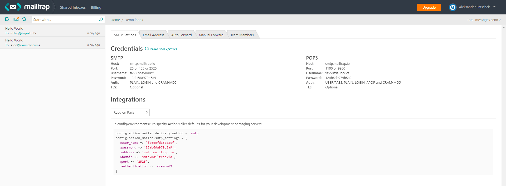

Wysyłanie maili to chyba jedna z najpopularniejszych opcji w aplikacjach internetowych. Zakładanie konta, zmiana hasła, wysłanie zapytania do pomocy, newslettery - wszystko to odbywa się przy pomocy maili. Jak więc skonfigurować naszą aplikację by była w stanie je wysyłać? Oraz jak testować tą funkcjonalność tak by nie zaśmiecić swojej skrzynki?

<!--more-->

## Nodemailer

Podczas szukania biblioteki dla Node.js, która pozwoliłaby mi na wysyłanie maili natknąłem się na `Nodemailer` i urzekła mnie ona prostotą konfiguracji i dalszego wykorzystania. Aby wykorzystać bibliotekę musimy ją najpierw zainstalować:

```console
yarn add nodemailer
```

Teraz pierwszą rzeczą jaką musimy zrobić to zdefiniować co będzie użyte aby wysłać nasze wiadomości email. Najczęściej wykorzystujemy jakiś serwer SMTP. O tym co zrobić gdy takiego serwera nie mamy albo potrzebujemy coś do testowania  napiszę w dalszej części postu. Na szczęście mamy też opcję, żeby nie wysyłać maila tylko przetworzyć dane i otrzymać w pełni poprawną wiadomość np.: w formacie JSON. I od tego sposobu zaczniemy ponieważ nadaje się bardzo dobrze na samym początku pisania kodu:

```js
const transport = nodemailer.createTransport({
    jsonTransport: true
});
```

Jak widać jest to bardzo proste. Teraz musimy zdefiniować wiadomość jaką chcemy wysłać. Wystarczy nam do tego prosty obiekt z odpowiednimi polami. Najbardziej podstawowa i pewnie również najczęściej wykorzystywana konfiguracja wygląda następująco: 

```js
let mailOptions = {
    from: 'test@example',
    to: "foo@example.com",
    subject: "Hello World",
    text: "Hello world?",
    html: "<b>Hello world?</b>",
};
```

Mamy tutaj tylko najbardziej wykorzystywane pola, których nie trzeba chyba tłumaczyć :) 

Teraz, żeby wysłać wiadomość musimy tylko wykorzystać metodę `sendMail` z naszej zmiennej przechowującej konfigurację wysyłania maili

```js
transport.sendMail(mailOptions);
```

Zwraca ona Promise wiec najlepiej jest cały powyższy kod zapakować w funkcję asynchroniczną i wywołać w następujący sposób 

```js
sendMail().then((result)=>{
    //obsługa sukcesu
}).catch((error)=>{
    //obsługa błędu
})
```

Dla tak zdefiniowanego maila jak wyżej dostaniemy następującą odpowiedź 

```json
{ 
  "envelope": "{ from: 'test@example', to: [ 'foo@example.com' ] }",
  "messageId": "<00e9dc01-1e37-9318-02ac-a81146e4b594@example>",
  "message:
   "{"from":{"address":"test@example","name":""},"to":[{"address":"foo@example.com","name":""}],"subject":"Hello World","text":"Hello world?","html":"<b>Hello world?</b>","headers":{},"messageId":"<00e9dc01-1e37-9318-02ac-a81146e4b594@example>"}" 
}
```

## Mailtrap

Jednak wypuszczenie takiego kodu do repozytorium jest właściwie bezużyteczne - nie potrzebujemy wysyłki maili, która nic nie wysyła :D. Musimy zmienić naszą konfigurację wysyłania maili tak żeby korzystała z serwera SMTP. Oczywiście do testowania nie będziemy podawać konfiguracji produkcyjnej - nie chcemy by ktoś przez przypadek dostał maila. Rozwiązaniem są serwisy udostępniające fałszywe serwery SMTP, dzięki którym nasza konfiguracja wygląda identycznie zarówno dla środowiska testowego jak i późniejszej produkcji. Po drugie wykorzystanie takiego fałszywego serwera sprawi, że pomimo tego że maile nie będą nigdzie wysyłane to będziemy je w stanie odczytać w serwisie. Przykładem takiego serwisu jest [Mailtrap](https://mailtrap.io/)
Po zarejstrowaniu się mamy dostęp do skrzynek pocztowych - w darmowym planie mamy tylko jedną ale jest to wystarczająco do testów. Kiedy wejdziemy do skrzynki zobaczymy taki oto widok. 



Po lewej mamy listę wszystkich wiadomości jakie wysłaliśmy. Po prawej natomiast widać wszystkie potrzebne ustawienia potrzebne do konfiguracji Nodemailer'a. Możemy je odczytać od razu lub wybrać opcję Nodemailer z dostępnych integracji i skopiować widoczny kod :) 


```js
const transport = nodemailer.createTransport({
    host: "smtp.mailtrap.io",
    port: 2525,
    auth: {
        user: "user",
        pass: "pass"
    }
});
```

Teraz zmienimy konfigurację i znowy wyślemy maila. Odpowiedź jaką teraz dostaniemy będzie wyglądała trochę inaczej:

```json
{ 
  "accepted": "[ 'foo@example.com' ]",
  "rejected": "[]",
  "envelopeTime": "425",
  "messageTime": "324",
  "messageSize": "528",
  "response": "250 2.0.0 Ok: queued",
  "envelope": "{ from: 'test@example', to: [ 'foo@example.com' ] }",
  "messageId": "<64306fcf-f8d1-743a-0d0e-6ae9d5ccec78@example>" 
}

```

Dostajemy w odpowiedzi informacje dotyczące wiadomości czyli czy udało się wysłać, jaki jest rozmiar itd. Natomiast w samym Mailtrapie widzimy nową wiadomość: 


Prawda, że proste? Nawet jeśli sami nie korzystacie z Node'a lub też macie inne swoje ulubione biblioteki to o Mailtrapie warto wiedzieć i korzystać - ułatwi to życie zarówno wam jak i waszym testerom. No i zmiana na wersję produkcyjną jest banalnie prosta bo wystarczy że zmienimy ustawienia w konfiguracji wysyłki maili - którą i tak najczęściej przechowujemy w zmiennych środowiskowych.


