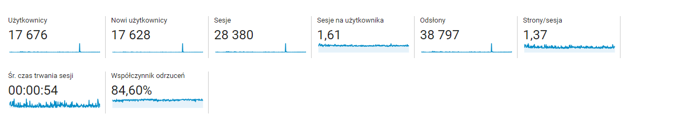
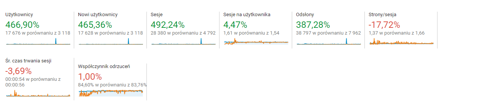

Rok 2018 był dla mnie niesamowitym okresem. Wydarzyło się wiele na blogu, który zaczął przyciągać coraz więcej czytelników oraz powoli kończę moje studia inżynierskie. Dziś krótkie podsumowanie co udało mi się zrobić i jakie plany są na aktualny rok - w końcu trzeba mieć jakieś postanowienia ;) 

<!--more-->

## 2018 na blogu 

W ostatnim roku mój blog stał się dużo bardziej widoczny w sieci co mnie niezmiernie cieszy. Według Google Analytics odwiedziło go ponad 17 tys użytkowników dając prawie 39 tys. odsłon. Dziękuję wam bardzo za to, bo to w głównej mierze wasza zasługa. To jest dla mnie najlepsza nagroda gdy to co tworzę jest odwiedzane i czytane przez was.

Statystyki wyglądają jeszcze lepiej gdy porównałem je z poprzednim rokiem - jest to prawie 5 raz więcej użytkowników i 4 razy więcej odsłon niż w 2017. W tym roku mam zamiar to pobić bo w końcu sky is the limit :) 

Najpopularniejszy post w tym roku to napisany na początku października o LaTeX'u - jest to głównie zasługa Wykopu, który wygenerował ruch rzędu 2 684 odsłon w ciągu jednej doby. Na drugim miejscu rekordzista czyli post dotyczący GraphQL, który napisałem na początku października 2017. Dodatkowo ostatnio jak patrzyłem to ciągle jest na pierwszej stronie Google'a jak się wpisze w wyszukiwarce `graphql` :) 

Oprócz samego pisania postów w tym roku zadbałem o media społecznościowe - Facebook i Twitter. Starałem się tam regularnie umieszczać ciekawe linki i materiały dotyczącego ogólnie programowania. Opłacił mi się ten krok ponieważ w tym roku doszło 156 polubień fanpage'a, za to na Twitterze jest już 53 obserwujących. W tym roku mam zamiar ciągle ulepszać swoje działania w tych obszarach by być jeszcze bardziej widocznym ;) 

## Plany na 2019 

W ostatnim kwartale nie miałem za wiele czasu na pisanie postów, ponieważ większość czasu poświęciłem na napisanie pracy inżynierskiej. Muszę przyznać, że pisanie tych kilkudziesięciu stron było najtrudniejszą rzeczą w całej pracy ;p. Ale miałem na szczęście trochę czasu na myślenie i przeanalizowałem czym zajmuje się na blogu. Zauważyłem, że mam trochę bałaganu, ponieważ pisałem w różnych językach, bibliotekach i cześć rzeczy nigdy nie była dokończona. 

Postanowiłem, że w tym roku na blogu będą się pojawiać tylko tematy związane z Javascript czyli Node.js, Typescript i pewnie biblioteki z tym związane. Jako, że moja praca inżynierska dotyczyła zagadnień związanych z uczeniem maszynowym to mam w planach również zacząć serię dotyczącą tego zagadnienia z wykorzystaniem JavaScriptu. Postaram się również przyjrzeć narzędziom, które pomagają usprawnić pracę lub też zabezpieczyć nas przed błędami - mam tu na myśli wszelakiego rodzaju narzędzia CI/CD. Mam nadzieję, że skupienie się na jednym obszarze pozwoli mi nie tylko na rozwój osobisty ale i pisanie ciekawszych postów.

Ostatnio zacząłem też mały projekt związany z Github Actions o czym pisałem w ostatnim poście (jeśli nie czytaliście to znajdziecie go [tutaj](https://fsgeek.pl/post/github-actions-konfiguracja-i-wlasne-obrazy/)), który na pewno dostarczy mi wiele inspiracji do pisania postów. Na początku roku mam zamiar się na nim skupić, choć już pojawiają się w moich notatkach plany na inne projekty. Oczywiście jeśli są tematy które was interesują i chcielibyście o nich poczytać to możecie śmiało do mnie pisać.
	
	

