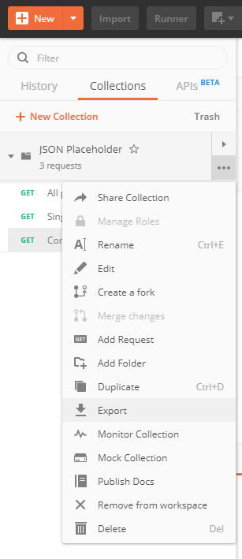
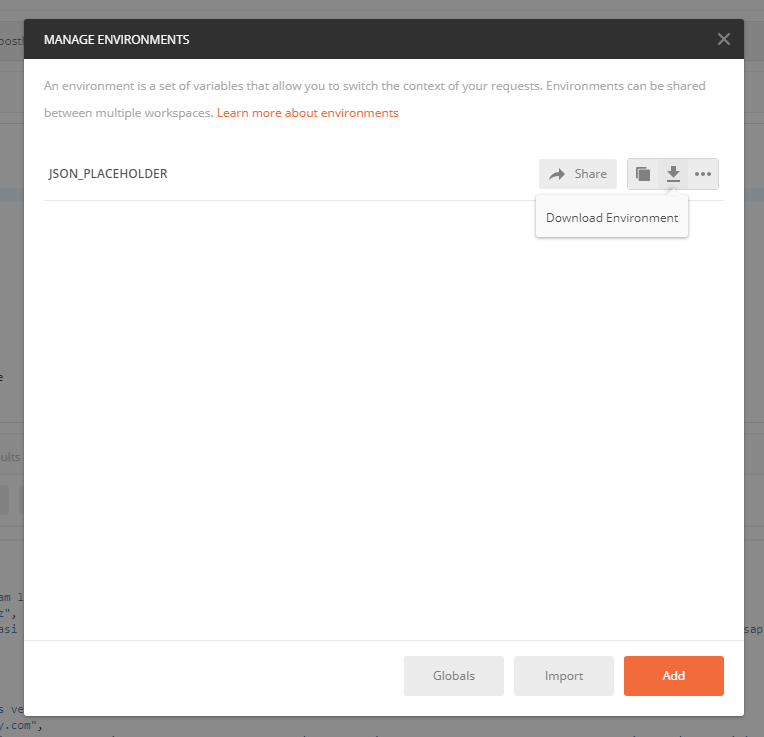
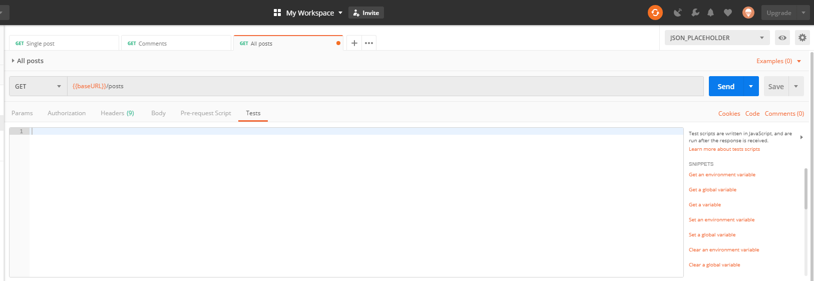
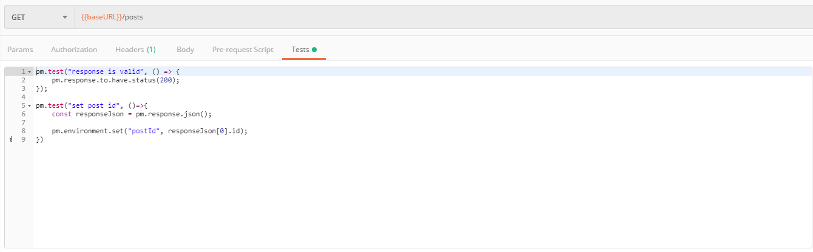
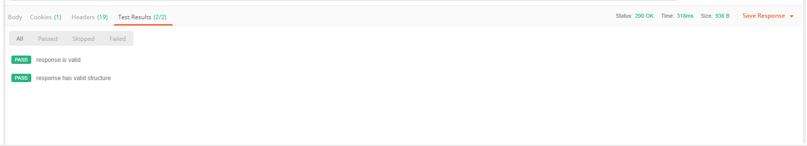
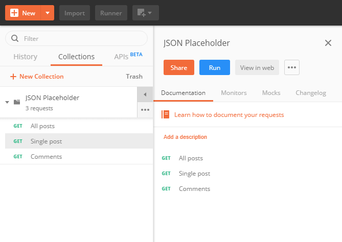
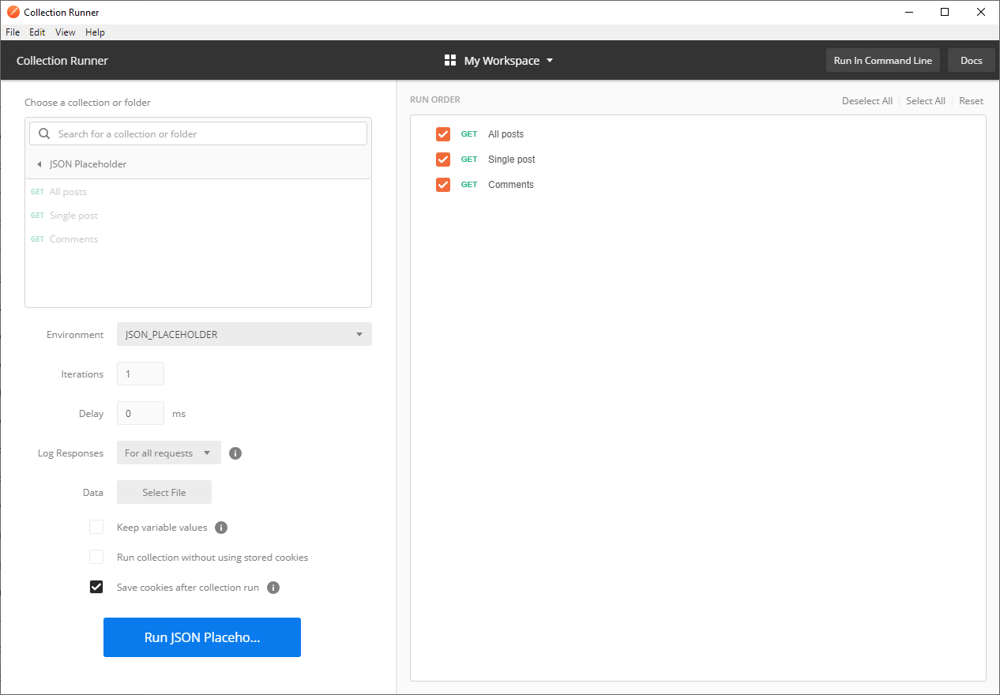
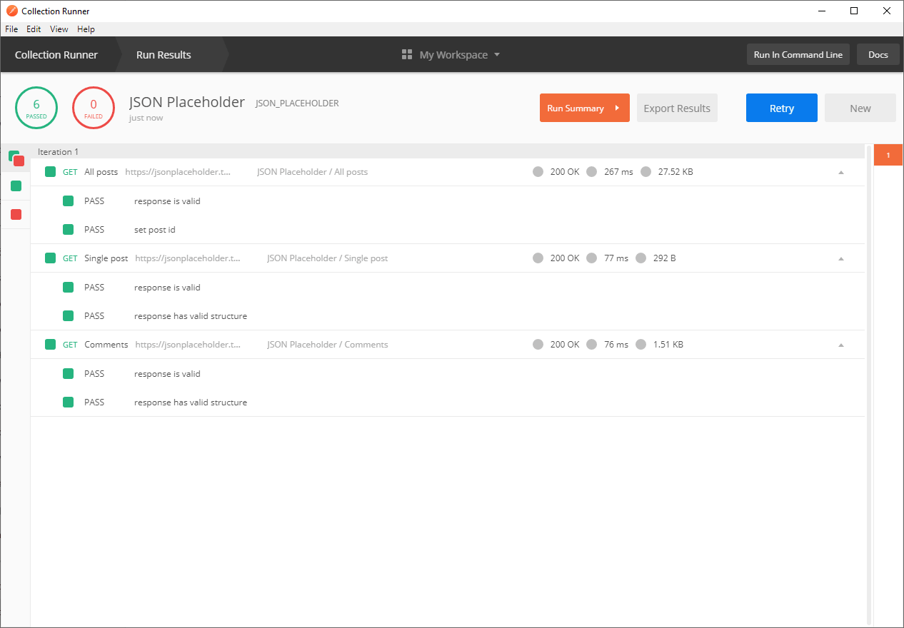

W ostanim wpisie pokazałem jak można zacząć pracę z Postmanem. Jednak możliwości Postmana nie ograniczają się tylko do wysyłania zapytań na serwer i odbierania odpowiedzi. Z jego pomocą możemy stworzyć proste testy API i wprowadzić automatyzację do naszego procesu testowego. 

<!--more-->

## Inne wpisy z Postmana

- [Postman - podstawy](/post/badz-produktywny-podstawy-postmana)

## Eksport danych

Jednak zanim przejdę do tematu testowania najpierw wspomnę o eksporcie kolekcji oraz zmiennych środowiskowych. Po co nam taka funkcjonalność? Rzadko kiedy pracujemy nad jakimś projektem w pojedynkę. A skoro więcej osób jest zaangażowanych, to nie tylko my mamy interes by korzystać z Postmana. Stworzenie odpowiednich kolekcji dla bardzo zaawansowanego API może być czasochłonne i nie ma potrzeby by każdy developer robił to z osobna. Dodatkowo w czasach gdzie większość projektów korzysta z gita taka wymiana wyeksportowanej kolekcji jest banalnie prosta.

Aby wyeksportować naszą kolekcję musimy kliknąć na opcję `Export` w menu naszej kolekcji



Następnie pojawi się okno dialogowe gdzie możemy wybrać w jakiej wersji formatu będziemy przechowywać kolekcję - jeśli nie wiecie co wybrać to zawsze polecam najnowszą wersję. 

Oprócz tego, że możemy eksportować kolekcje to warto jeszcze zapisać zmienne środowiskowe - o ile ich używamy.
Aby to zrobić musimy wejść do okna dialogowego gdzie możemy zarządzać wszystkimi środowiskami i tam mamy opcję do eksportu



Eksport jest najprostszym sposobem na dzielenie się z innymi członkami zespołu naszą kolekcją oraz środowiskami. Wystarczy, że taki plik umieścimy samodzielnie w repozytorium i inni członkowie zeposłu będą mogli go zaimportować. Oczywiście są też minusy takiego ręcznego umieszczania pliku - rozwiązywanie konfliktów może boleć. Istnieją także lepsze sposoby na współdzielenie naszych kolekcji - zostaną one poruszone w następnym poście.

## Testy

Testy API zazwyczaj kojarzą się z osobnymi bibliotekami i frameworkami. Takie rozwiązanie jest dobre o ile potrafimy korzystać z takiej biblioteki, potrafimy postawić sobie środowisko by to uruchomić i mamy czas na aktualizowanie. Ciekawym pomysłem na pisanie testów może być wykorzystanie do tego celu Postmana - skoro i tak go wykorzystujemy to wystarczy dopisać parę linijek i będziemy mieć działające testy automatyczne. 

Testy dla naszych ednpointów możemy stworzyć wchodząc w ostatnią zakładkę - `Tests`.




Mamy tam puste pole tekstowe, które możemy wypełnić naszymi testami. To ile testów wpiszemy w to pole zależy od nas i specyfiki danego endpointu. Należy tylko pamiętać, że testy będą dotyczyły tego konkretnego endpointu i danych jakie są aktualnie w nim wpisane. Więc jeśli jakiś endpoint może posiadać kilka możliwości ustawień np. parametrów i chcemy zautomatyzować jego testowanie to najlepiej by było stworzyć kilka osobnych endpointów tak by każdy pokrywał jeden przypadek. 

Co możemy testować w takim endpoincie? Mogę podać kilka możliwości: 

- Czy status jest odpowiedni
- Czy zwraca poprawne dane
- Czy struktura jest poprawne
- Czy zawiera odpowiednie nagłówki

Jak może wyglądać taki przykładowy test? 



```js
pm.test("response is valid", () => {
    pm.response.to.have.status(200);
});

pm.test("set post id", ()=>{
    const responseJson = pm.response.json();

    pm.environment.set("postId", responseJson[0].id);
})
```

W pierwszym teście sprawdzam czy dostałem poprawny status odpowiedzi. Ciekawy jest natomiast drugi test ponieważ pobieram w nim id posta z odpowiedzi i umieszczam w zmiennej środowiskowej. Po co mi coś takiego? Dzięki temu możemy stworzyć cały proces testowania - od stworzenia jednostki, gdzie dostajemy jej id, po edycję i usuwanie. Nie musimy ani polegać na tym, że jednostka o takim id istnieje w systemie od kiedy stworzyliśmy test ani ingerować w testy szczególnie kiedy będą odpalane automatycznie jedne po drugim. 

Inny przykład testów to sprawdzenie czy struktura jaka jest zwracana przez endpoint jest poprawna. Tutaj możemy skorzystać z biblioteki [tv4](https://github.com/geraintluff/tv4) lub [ajv](https://github.com/epoberezkin/ajv) - ja pokażę dzisiaj tą drugą. Pokażę dwa przypadki które można spotkać najczęściej czyli endpoint zwraca pojedynczy obiekt lub grupę obiektów. Zacznijmy od tego pierwszego

```js
const Ajv = require('ajv');
const ajv = new Ajv({logger: console});
const schema = {
        "properties": {
            "userId": {
                "type": "number"
            },
            "id": {
                "type": "number"
            },
            "title": {
                "type": "string"
            },
            "body": {
                "type": "string"
            }
        },
        "additionalProperties": false
    };

pm.test("response is valid", () => {
    pm.response.to.have.status(200);
});

pm.test("response has valid structure", () => {
    pm.expect(ajv.validate(schema, pm.response.json())).to.be.true;
});

```

Najpierw musimy określić co to znaczy poprawny schemat czyli go opisać - określić jakie są pola są dozwolone oraz jaki powinny mieć typ. Następnie wykorzystujemy mechanizmy samej biblioteki oraz Postmana by w teście określić czy endpoint odpowiedział poprawnie. Drugi przypadek to tablica obiektów.

```js
const Ajv = require('ajv');
const ajv = new Ajv({logger: console});
const schema = {
  "type": "array",
  "items": {
    "type": "object",
    "properties": {
        "postId": {
            "type": "number"
        },
        "id": {
            "type": "number"
        },
        "name": {
            "type": "string"
        },
        "email": {
            "type": "string"
        },
        "body": {
            "type": "string"
        },
    },
    "additionalProperties": false
  },
};

pm.test("response is valid", () => {
    pm.response.to.have.status(200);
});

pm.test("response has valid structure", () => {
    console.log(pm.response.json())
    pm.expect(ajv.validate(schema, pm.response.json())).to.be.true;
});
```
Konfiguracja jest podobna - różni się tylko tym, że element na najwyższym poziomie będzie tablicą. 


## Automatyzacja testów

Jak odpalać napisane przez nas testy? Odpalają się one zawsze wtedy gdy wysyłamy zapytanie na serwer



Automatyczne testowanie to jeszcze nie jest ponieważ musielibyśmy ręcznie zrobić to dla każdego endpointu. Na szczęście możemy uruchomić wszystkie testy w kolekcji. 

Aby to zrobić musimy rozwinąć panel dla naszej kolekcji i kliknąć `Run`.



Otworzy nam się nowe okno gdzie zobaczymy wszystkie zdefinowane przez nasz endpointy oraz będziemy w stanie uruchomić wszystkie w jednym momencie. 



Oprócz tego, że możemy uruchomić testy możemy manipulować ich kolejnością, ustawić aktualne środowisko, stopień logowania informacji itd.



Po tym jak uruchomimy testy dostaniemy widok podsumowania gdzie będziemy widzieć informację jakie testy zostały uruchomione, jaki jest ich rezultat oraz zapisać je. No i mamy nasze testy automatyczne. Teraz po zmianach a API możemy uruchomić nasze testy by mieć pewność, że nie wystąpiła regresja. Prawda, że proste? Wiedzieliście o takiej możliwości Postmana? A jeśli tak to korzystaliście?

