Postman jest jedną z wielu aplikacji pozwalających na wysyłanie zapytań do serwera. Według mnie znajomość jednego z takich narzędzi jest przydatna nieważne czy się pracuje na frontendzie, backendzie czy jako tester. Właściwie wykorzystywany Postman potrafi ułatwić życie i przyspieszyć testowanie oraz tworzenie endpointów. Jednak jak z niego korzystać tak aby to była czysta przyjemność?

<!--more-->

## Inne wpisy z Postmana

- [Postman - testy](/post/badz-produktywny-testy-w-postmanie)

## Tworzenie endpointów

Jak już wspomniałem Postman służy do komunikacji z serwerem. Możemy za jego pomocą pobierać potrzebne informacje z serwera, testować czy endpointy zostały poprawnie zaimplementowane lub jeśli nie ma pełnej dokumentacji API testować jak należy wysyłać zapytania. 

Żeby pokazać w jaki sposób można wygodnie testować API skorzystałem z istniejącej strony [jsonplaceholder.typicode.com](https://jsonplaceholder.typicode.com/) - możecie ją również wykorzystać jako poligon testowy. Możemy się z nią komunikować za pomocą 4 najpopularniejszych zapytań czyli: GET, POST, PUT, DELETE (żeby poznać szczegóły zachęcam do odwiedzenia strony).  

Aby w Postmanie wysłać zapytanie na serwer musimy wykonać 3 kroki

- wybrać jaki rodzaj zapytania chcemy wykonać z rozwijanej listy (np.: GET)
- Wpisać URL z jakim chcemy się komunikować
- Kliknąć przycisk Send

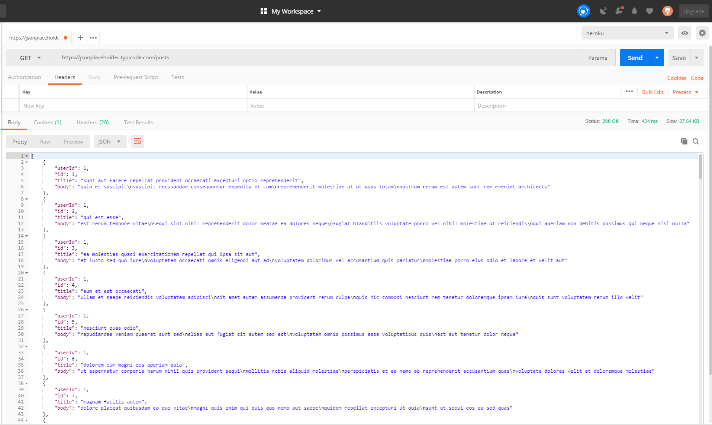

Jeśli wszystko jest poprawne to powinniśmy otrzymać odpowiedź oraz informacje dotyczące odpowiedzi czyli status, czas oraz rozmiar odpowiedzi.

Oczywiście zapytania nie zawsze są takie proste - mogą zawierać na przykład dodatkowe parametry w URL'u. Możemy oczywiście podobnie jak poprzednio wkleić URL z dodatkowymi parametrami ale lepiej jest skorzystać z opcji `Params` - znajduje się na lewo od `Send`

Dla przykładu zapytanie `https://jsonplaceholder.typicode.com/posts?userId=1` będzie wyglądać następująco: 

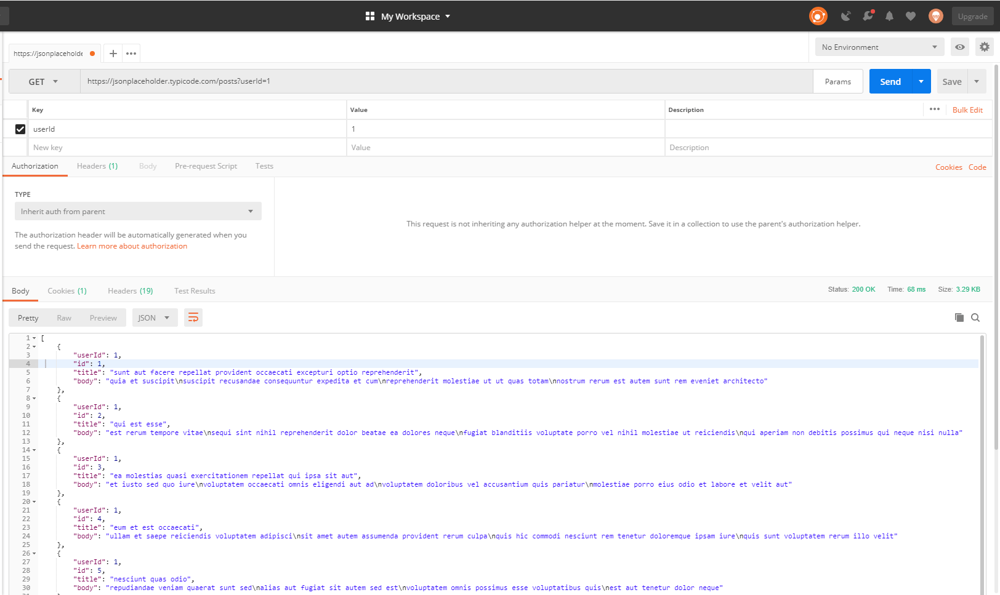

Taki sposób postępowania jest bardzo wygodny, ponieważ pozwala na dowolne włączanie i wyłączanie parametrów i nie musimy się martwić o to czy URL jest zbudowany poprawnie - przy dużej ilości parametrów to może być kłopotliwe.

Do pełni szczęścia został jeszcze endpoint POST i PUT gdzie musimy wysłać więcej danych. Wtedy wykorzystamy zakładkę `Body`. Tutaj najczęściej będzie nas interesował typ `raw` oraz format `JSON(application/json)`

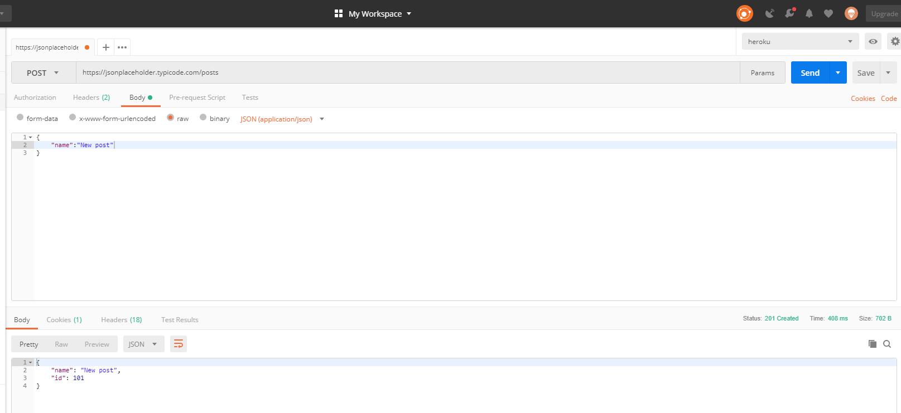

## Kolekcje
Kolejna rzecz to zapisywanie testowanych przez nas endpointów - przecież nie będziemy ich za każdym razem pisać od nowa. Najprościej jest wybrać opcję zapisu, która znajduje się na prawo od `Send`. Ale jeśli będziemy mieli bardzo dużo endpointów to okaże się, że szybciej wpiszemy pożądany endpoint od nowa niż znajdziemy go na liście :) Na szczęście możemy grupować nasze endpointy w kolekcje. 

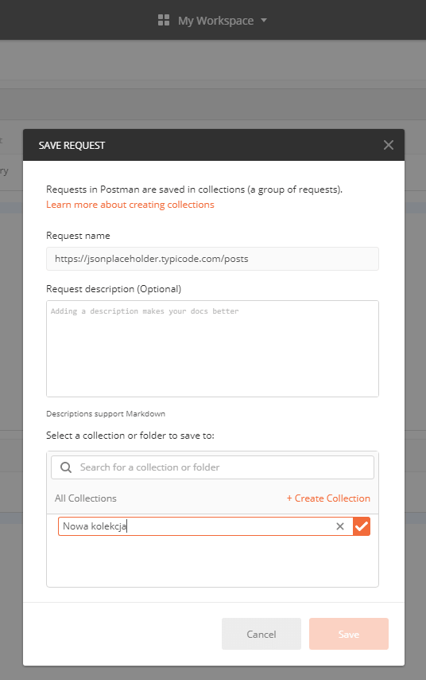

Ja lubię tworzyć kolekcję dla projektu nad którym aktualnie pracuję i potem dla każdego zasobu jest tworzony osobna kolekcja np.: `Post` - w ten sposób wszystko jest poukładane i pojedyncza kolekcja ma około 5 endpointów. 

## Środowiska

Najczęściej jak tworzymy oprogramowanie to nie mamy jednego środowiska tylko kilka. I często zadrza się, że na jednym środowisku endpoint działa poprawnie a na drugim nie i trzeba sprawdzić skąd różnice. Korzystając z Postmana możemy stworzyć osobne kolekcje dla każdego środowiska i trzymać w nich ten sam zbiór endpointów. Jednak nie jest to wygodne i szybciej niż później się okaże, że będziemy musieli aktualizować pojedynczy endpoint w kilku miejscach. Da się to na szczęście zrobić lepiej. 

W Postmanie mamy możliwość tworzenia środowisk oraz zmiennych w nich. Polega to na tym, że w endpointach zamiast pisać adres URL to odwołujemy się do zmiennej która ten adres przechowuje np.: `{{baseUrl}}`. Teraz jak będzie trzeba sprawdzić endpoint na innym środowisku to wystarczy stworzyć nowe lub przełączyć na inne już istniejące.

Jak stworzyć takie środowisko? 

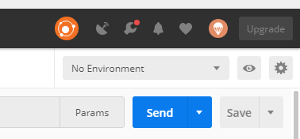

Nad przyciskiem Send mamy 3 kontrolki które sterują środowiskami. Od lewej mamy: 

- Pole typu Select aby wybrać z jakiego środowiska aktualnie korzystamy
- Podgląd na zmienne zdefiniowane w aktualnym środowisku 
- Ustawienia związane z środowiskami - to tam się kierujemy aby stworzyć nowe środowisko

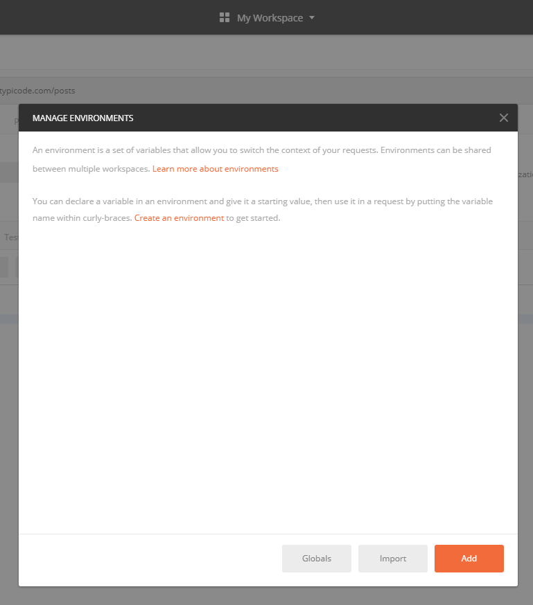

Teraz musimy wpisać nazwę naszego środowiska oraz wpisać zmienne jakich chcemy używać

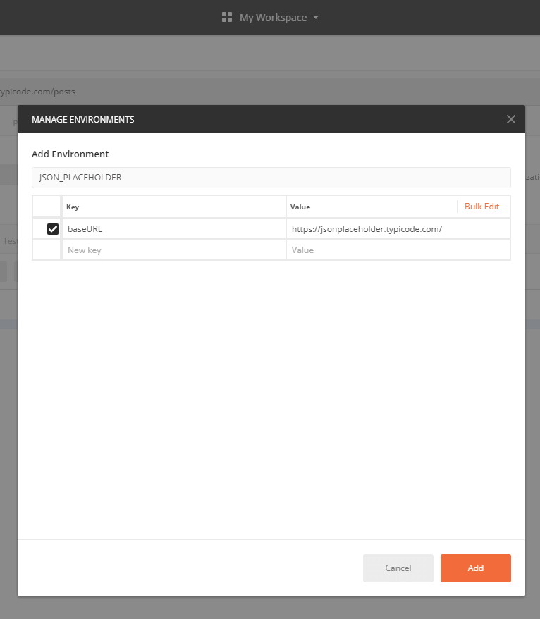

Oczywiście nie musimy wpisywać od razu wszystkich zmiennych - możemy to zrobić przyrostowo w zależności od potrzeb. Teraz wystarczy wybrać nasze nowo stworzone środowisko by móc korzystać ze zmiennych
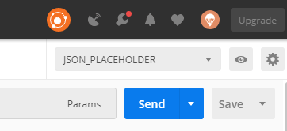
	
## Uwierzytelnianie

Na sam koniec temat popularny w API, który czasami może powodować problemy. Postman wspiera kilka rodzajów uwierzytelniania, z których możemy skorzystać.

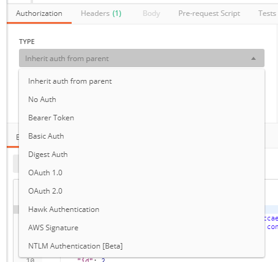

Najprostsze rozwiązanie to ustawienie uwierzytelniania na poziomie samego endpointu. Jednak jeśli mamy ich sporo to będzie to uciążliwe. Warto tutaj zwrócić uwagę na jeden szczególny typ uwierzytelniania - `Inherit auth from parent`. Oznacza to tyle, że jesteśmy w stanie ustawić uwierzytelnianie na poziomie całej kolekcji a Postman za nas umieści ją potem w odpowiednich endpointach. Aby ustawić takie uwierzytelnianie musimy wejsć do edycji naszej kolekcji;

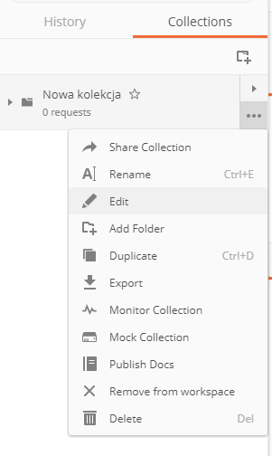

Teraz wystarczy, że ustawimy odpowiednie uwierzytelnianie i wszystkie nasze endpointy go otrzymają. Oczywiście jeśli nasza kolekcja znajduje się w innej kolekcji to możemy ustwić dziedziczenie uwierzytelniania i ustawić je dla kolekcji wyżej. Dzięki temu zmiana tego ustawienia lub wpisanie nowego tokenu będzie odbywała się w jednym miejscu i będzie zrobiona bardzo szybko.

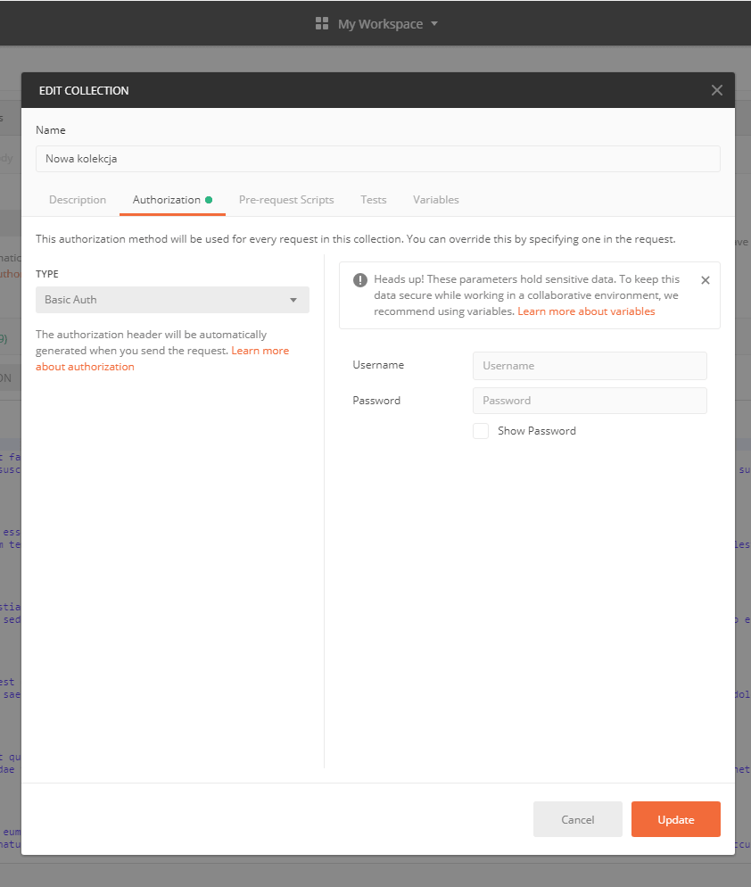

A wy korzystacie z Postmana? A może macie jakieś inne aplikacje do wysyłania requestów? A może tylko konsola i CURL? Jestem ciekawy jak wam się z tym pracuje i czego wam brakuje.