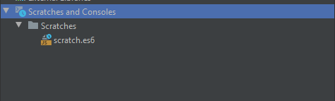
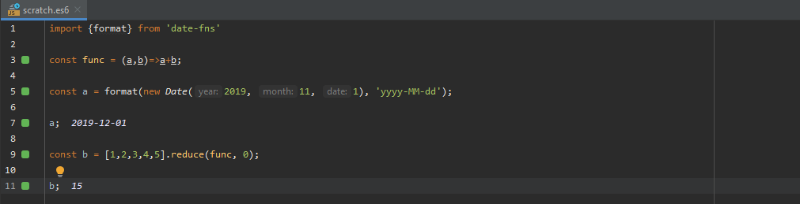
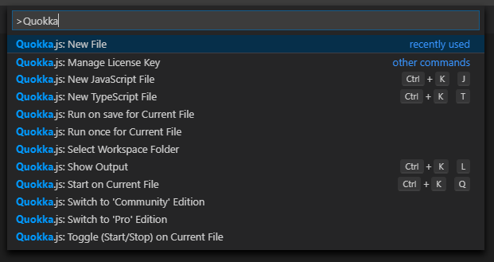

Czasami podczas tworzenia aplikacji musimy na szybko sprawdzić kawałek kodu. Możemy do tego wykorzystać naszą przeglądarkę i konsolę by sprawdzić wyrażenie lub na szybko coś przetestować. A może możemy przenieść konsolę z przeglądarki do naszego edytora?

<!--more-->

## Quokka

Ja osobiście bardzo często wykorzystuję konsolę w przeglądarce by na szybko sprawdzić jakiś pomysł lub czy dana konstrukcja zadziała i dostanę taki wynik jaki oczekuję.  I tak jak świetnie to się sprawdza w przypadku np.: operacji na elementach tablicy tak ciężko jest to wykorzystać by sprawdzić konkretną bibliotekę. Mnie najczęściej się to zdarza gdy wykorzystuję bibliotekę do operacji na datach (lub czasie) np.: date-fns czy moment i potrzebuję sprawdzić czy funkcja zwraca mi to co potrzebuję. I tutaj idealnie sprawdza się rozwiązanie, które znalazłem ostatnio czyli Quokka. Przenosi ona konsolę do naszego IDE wraz z dodatkowymi możliwościami. Jedną z tych istotnych jest dla mnie właśnie możliwość importowania bibliotek, które mamy w projekcie. Oczywiście można też kupić wersje PRO, która dodaje kolejne funckjonalności między innymi opcję importowania plików, które sami stworzyliśmy w projekcie.

## Instalacja w WebStorm

Instalacja w WebStorm jest banalnie prosta i sprawdza się do zainstalowania pluginu `Quokka`. Teraz wystarczy, że wykorzystamy istniejący w IDE mechanizm `Scratches`

 

W momencie gdy dodamy tam plik to automatycznie uruchomi się tam Quokka i będzie wyświetlała nam zawartość kolejnych zmiennych i wyrażeń z których będziemy korzystać.

Jak widać nie musimy nawet opakowywać zmiennych w `console.log` by zobaczyć co jest w środku 

## Instalacja w Visual Studio Code

Podobnie jak w Webstorm tutaj instalacja sprowadza się do zainstalowania odpowiedniego pluginu.  Następnie przy pomocy palety komend (`Ctrl/Cmd + Shift + P`) musimy wpisać `Quokka: New File` co stworzy opowiedni plik i podepnie do niego plugin. 

Jednak tutaj jakbyśmy chcieli zapisać ten plik i zostawić go sobie na póżniej to zostanie on zapisany w naszym projekcie - Webstrom z mechanizmem Scratches ma to troszke lepiej to rozegrane bo nasze testy i pliki projektu są rozdzielone. 

Co myślicie o takim rozwiązaniu jako zastąpieniu konsoli na potrzeby testowania funkcjonalności Javascriptu oraz bibliotek? Oczywiście nie jesteśmy w stanie testować np.: operować na elementach w drzewie DOM. Jednak jeśli nie potrzebujemy tego lub piszemy aplikacje w Node.js i musimy coś przetestować to jak dla mnie jest to naprawdę dobre rozwiązanie i warto mieć to w swoim IDE. Od jakiegoś czasu z tego korzystam i musze przyznać, że bardzo mi się podoba Quokka i co najważniejsze sprawdza się podczas pisania kodu.

