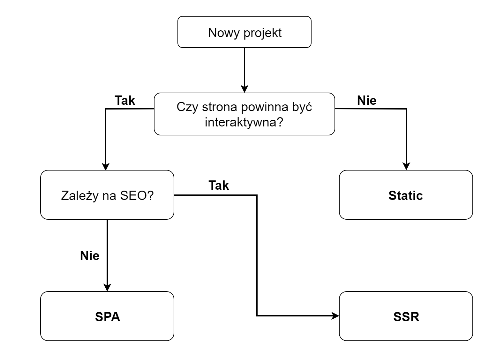

Dzisiaj nie ma jednego dobrego sposobu na tworzenie stron internetowych. Możemy korzystać ze SPA, SSR czy też stron statycznych. Każde z tych rozwiązań posiada swoje plusy i minusy. Zanim zaczniemy nowy projekt, warto rozważyć wszystkie wady i zalety by potem nie żałować. 

<!--more-->

## SPA czyli Single Page Application

Na początek strony typu SPA czyli Single Page Application, które tworzymy przy pomocy takich frameworków (bibliotek) jak React, Angular czy Vue. Mamy tutaj tak naprawdę pojedynczy plik html, który stanowi punkt wejścia i następnie władzę przejmuje kod Javascript. W tym rozwiązaniu to JS jest w całości odpowiedzialny za renderowanie treści. Dzięki temu można tworzyć wysoce interaktywne strony dla użytkowników. Ma to też swoje minusy jak na przykład czas ładowania strony czy SEO. Zanim zostanie wyrysowany na ekranie pierwszy widok, to przeglądarka musi pobrać cały plik JS'a, zinterpretować i go dopiero potem może go uruchomić. W przypadku dużych stron może to zajmować sporo czasu. Drugim minusem jest na pewno SEO. Z racji tego, że za umieszczanie elementów w drzewie DOM jest odpowiedzialny kod JS, to robot indeksujący otrzymuje pustego HTML'a zamiast treści. Oczywiście trzeba przyznać, że roboty indeksujące coraz lepiej sobie radzą z SPA ale indeksowanie ich zajmuje dużo więcej czasu niż w przypadku stron, o których wspominam niżej.

## SSR czyli Server-side rendering

Server-side rendering jest takim kołem wymyślonym na nowo. Zanim nastał czas Single Page Application, to był główny sposób w jaki tworzono aplikacje i dostarczano je użytkownikowi. Schemat działania jest prosty - wysyłamy informacje na serwer, tam są one przetwarzane i następnie jest generowany gotowy widok, który jest zwracany użytkownikowi. Dzięki temu w momencie gdy strona jest zwracana posiada wszystkie informacje i roboty indeksujące są w stanie je dużo łatwiej zaindeksować. Powoduje to, że jest to dużo lepsze rozwiązanie jeśli zależy nam na SEO i pozycji w wyszukiwarce. Problemem jest dużo mniejsza interaktywność w porównaniu z SPA. W najprostszym przypadku żeby otrzymywać nowe dane musimy wykonać nowe zapytanie na serwer co wiąże się z przeładowaniem strony. Można to oczywiście rozwiązać przy pomocy kodu Javascript, który będzie pobierał dane i podmieniał na stronie, jednak nie jest to rozwiązanie tak wygodne jak w przypadku SPA.  Kiedyś takie strony były tworzone przy pomocy PHP, natomiast dzisiaj mamy również rozwiązania pozwalające na tworzenie SSR w JS'ie np.: Next.js. 

## Static sites

Statyczne strony jest pójściem o krok dalej w stosunku do tego, co było w SSR. Tym razem nie tworzymy strony na serwerze tylko mamy gotowy plik html, który jest tylko zwracany przez serwer. Dzięki temu eliminujemy czas potrzebny na wygenerowanie strony i to rozwiązanie jest jednym z najszybszych - oczywiście pod warunkiem, że zrobimy to dobrze (np.: nie zwracamy bardzo dużych obrazków albo dużych plików javascript). Minusem tego rozwiązania jest na pewno najmniejsza interaktywność na stronie (a właściwie jej brak). Dlatego też w ostatnich latach widać popularność tych rozwiązań wśród blogów gdzie potrzebujemy tylko wyświetlić użytkownikowi post, a on nie potrzebuje nic więcej na samej stronie robić. Pod względem SEO jest podobnie jak w SSR ponieważ roboty od Google'a dostają gotową stronę, którą można indeksować. Z racji tego, że jest to dosyć popularne rozwiązanie, to mamy kilka bibliotek, które nam to ułatwiają np.: Jekyll, Hugo lub Gatsby.

## Co wybrać?

Najważniejsze pytanie jakie powinniśmy sobie zadać jak zaczynamy nowy projekt to, które rozwiązanie jest dla nas najlepsze. Nie jest to zawsze proste ale można się posiłkować poniższym diagramem:

Oczywiście jest to najprostszy podział i w przypadku prawdziwych projektów będzie trzeba wziąć pod uwagę wiele innych czynników. Jednak warto przede wszystkim się zastanowić czy potrzebujemy SEO. Jeśli jest to istotny element, to pójście w SPA zdecydowanie je obniży i koszt naprawy tego później będzie bardzo duży (lub nawet niemożliwy w przypadku dużych aplikacji). Możemy też przeanalizować aplikację dokładniej i podzielić ją na dwie części:
- Pierwsza, która jest publicznie dostępna i zależy nam na SEO - tutaj dobry wybór to SSR lub strona statyczna
- Druga, która jest dostępna po zalogowaniu i tutaj nie zależy nam na SEO a bardziej na interaktywności i lepszym UX dla użytkownika końcowego - tutaj dobrym wyborem jest SPA

Ważne żeby podjąć decyzję świadomie by później jej nie żałować ;)

