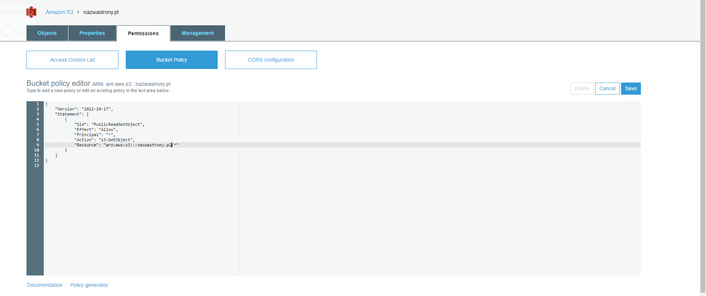

Jak już wspomniałem w ostatnim poście statyczne strony mnie w pewien sposób zauroczyły. Ich prostota oraz duże możliwości kuszą pomimo początkowych trudności. Dziś omówię jedną z tych trudności a więc wypuszczenie naszego projektu poza cztery ściany localhosta.
<!--more-->

## AWS robisz to dobrze 

Możecie się spytać czemu AWS a nie Heroku, DigitalOcean lub każdy inny możliwy hosting. Odpowiedź jest prosta: AWS jest cudowną usługą, która posiada wszystko co potrzebne naszym aplikacjom. Oprócz tego jest to aktualnie chyba najpopularniejsza usługa gdzie się trzyma strony, aplikacje oraz serwisy więc warto go poznać na jakimś własnym drobnym projekcie. No i po trzecie(a dla niektórych jako pierwsze) jest tani. Płacimy tutaj tylko za wykorzystane zasoby. Nie będzie więc sytuacji gdzie wykorzystujemy 30mb a musimy płacić za 500mb ponieważ nie ma mniejszego planu.

Dodatkowo jeśli nie mieliśmy wcześniej konta to dostajemy rok za darmo z potężną ilością serwisów oraz rozsądnych limitów. Więcej na temat darmowego pierwszego roku możecie poczytać tutaj: [AWS Free Tier](https://aws.amazon.com/free/).

W ten sposób korzystanie z AWS w przypadku stron statycznych będzie kosztować(przynajmniej przez pierwszy rok) parę centów na miesiąc co już powinno być zachętą do używania. Jednak posiadanie konta na AWS nie wystawi za nas strony internetowej. Trzeba parę rzeczy zrobić.

## S3 Buckets

Ta usługa AWS to jest nic innego jak pojemniki na nasz kod. Pozwalają umieścić cokolwiek chcemy w internecie i dzielić się tym jak tylko chcemy. AWS udostępnia także dużą gamę ustawień, które pomagają przy konfiguracji serwisu pod nasze potrzeby. W naszym przypadku nie będzie tu dużo ustawień co jest dobrym objawem. Jednak zacznijmy od początku. Do naszej statycznej strony będziemy potrzebowali dwóch pojemników: nazwastrony.pl oraz www.nazwastrony.pl przy czym ten drugi pojemnik będzie tylko przekierowywał ruch do pierwszego. Aby dodać pojemnik musimy kliknąć na Create bucket. 

Wyświetli nam się modal do którego wpiszemy adres naszej strony oraz wybierzemy lokalizację. W tym momencie możemy kliknąć na przycisk Create ponieważ resztę konfiguracji dokonamy za chwilę. W ten sam sposób należy stworzyć pojemnik z przedrostkiem 'www.' w nazwie.

## Konfiguracja pojemników

Teraz zostało nam już naprawdę niewiele do poprawnego działania naszej strony. Pierwsze co trzeba zrobić to zaznaczyć że nasz pojemnik będzie służył za statyczną stronę. Aby to zrobić musimy kliknać na nasz pojemnik, wybrać zakładkę Properties i następnie kliknąć na Static website hosting i wybrać opcję: Use this bucket to host a websit.  


Warto spojrzeć na adres który widnieje teraz u góry obszaru. Jest to adres naszej strony dopóki nie podłączymy jej z naszą domeną. Taką samą rzecz należy wykonać dla pojemnika z przedrostkiem www z tą różnicą że tutaj wybierzemy opcje Redirect request i wpiszemy tam nazwę naszego pierwszego pojemnika. 

Wydawałoby się że to wszystko jednak nie do końca. Domyślnie wszytskie pojemnika w S3 są prywatne i musimy jawnie zadeklarować że chcemy udostępnić nasz pojemnik publicznie w internecie. Aby to zrobić trzeba wejść do pojemnika nazwastrony.pl wybrać zakładkę Permissions i kliknąć na opcje Bucket Policy. Trzeba tam wkleić następującego JSON'a

```json
{
    "Version": "2012-10-17",
    "Statement": [
        {
            "Sid": "PublicReadGetObject",
            "Effect": "Allow",
            "Principal": "*",
            "Action": "s3:GetObject",
            "Resource": "arn:aws:s3:::nazwastrony.pl/*"
        }
    ]
}
```           

W tym momencie to już wszystko. Teraz można bez przeszkód wrzucić swoje pliki do pojemnika i cieszyć się działającą stroną. Pochwalcie się czy wam się udało. Nie jest to takie ciężkie jak się wydaje na pierwszy rzut oka. Teraz zostało nam połączenie naszych pojemników z wykupioną domeną. Ja to zrobiłem przy pomocy Cloudfront co opiszę to w następnym poście. Do usłyszenia. 
