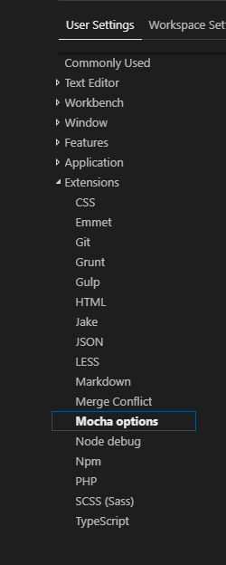
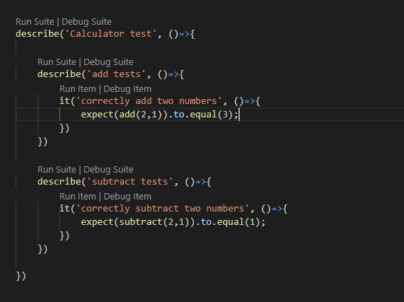

Jak często powtarzam pisanie testów jest istotną częścią tworzenia kodu. Chronią nas przed błędami, utrzymują nasz kod w dobrym stanie oraz pomagają podczas zmian w nim. W JavaScript mamy wiele bibliotek, które pomagają nam w tworzeniu oraz uruchamianiu testów zarówno na środowiskach lokalnych jak i w narzędziach CI/CD. Jedną z nich jest biblioteka Mocha, o której dziś piszę.

<!--more-->

## Instalacja i konfiguracja Mocha 

Aby zacząć korzystać z biblioteki Mocha musimy ją najpierw zainstalować przy pomocy polecenia `yarn add mocha --dev`. Teraz wystarczy dodać do sekcji `scripts` w pliku `package.json` taki wpis `"test": "mocha"`. Od tego momentu jesteśmy w stanie odpalać nasze testy korzystając z polecenia `yarn test`. Takie polecenie zadziała jednak tylko w momencie gdy w naszym projekcie mamy folder `test` w którym trzymamy wszystkie nasze testy. Mocha jako testy traktuje te pliki, które mają rozszerzenie `*.spec.js` lub `*.test.js` - możemy to stosować zamiennie ale lepiej wybrać jeden sposób i się go trzymać. 

Jeśli jesteście zwolennikami pisania testów obok normalnych plików (tak jak ja) to do polecenia należy dodać ścieżkę, w której Mocha ma szukać testów np.: `src/**/*.js` - w tym przypadku będzie szukał we wszystkich folderach, które są w folderze `src` i mają odpowiednie rozszerzenie. 

## Tworzenie testów

Testy konstruujemy przy pomocy dwóch bloków: 

- `describe` - jego zadaniem jest stworzenie opisu i pogrupowanie testów według ich przeznaczenia
- `it` - służy do faktycznego tworzenia przypadków testowych. Tutaj umieszczamy kod, który uruchomi to co chcemy testować oraz sprawdzi czy zwrócony wynik jest zgodny z założeniami

Przykładowe użycie dla modułu kalkulatora, który zawiera w sobie metody do obliczania sumy dwóch liczb moze wyglądać następująco: 

```
describe('Calculator test', ()=>{
    it('correctly add two numbers', ()=>{
        //ciało testu
    })

   // nasze kolejne testy 
})

```

Możemy również zagnieżdżać w sobie funkcje `describe` dzięki czemu testy będą jeszcze bardziej pogrupowane. Przykładowy test z góry możemy wtedy przestawić w następujący sposób:

```
describe('Calculator test', ()=>{
    
    describe('add tests', ()=>{
        it('correctly add two numbers', ()=>{
            //ciało testu
        })
        // Inne testy dla dodawania
    })
   
   // reszta testów
})

```

Teraz najważniejsza część czyli ciało funkcji `it` gdzie faktycznie ma miejsce testowanie. W `Mocha` domyślnie do testowania możemy wykorzystać dostępną w Node.js bibliotekę [assert](https://nodejs.org/api/assert.html) gdzie w pierwszym parametrze podajemy najczęsciej wynik naszej funkcji, a w drugim spodziewany rezultat. W momencie jeśli te dwie wartości będą się różniły to biblioteka wyrzuca błąd, który następnie łapie `Mocha` wyświetlając rezultat i oznaczająć test jako nieudany.

```
const assert = require('assert');

describe('add tests', ()=>{
    it('correctly add two numbers', ()=>{
        assert.equal(add(2,1),3)
    })
})
```

## Chai 
Dobre testy mogą służyć za świetną dokumentację. Jeśli wykorzystujemy tylko Mocha to czytanie assertów może nie być najprzyjemniejszą czynnością. Lepiej by było gdyby struktura testów pozwalała na czytanie ich jak książki. Aby to osiągnąć możemy użyć biblioteki `Chai.js`, która daje nam metody pozwalające pisać testy w BDD (Behavior-Driven Development). Instalujemy ją poleceniem `yarn add chai --dev` i od tego momentu możemy wykorzystać metodę `expect` i `should`. Modyfikując poprzedni test wyglądałoby to następująco: 

```
const {expect} = require('chai')

describe('add tests', ()=>{
    it('correctly add two numbers', ()=>{
        expect(add(2,1)).to.equal(3);
    })
})
```


```
const should = require('chai').should();

describe('add tests', ()=>{
    it('correctly add two numbers', ()=>{
        add(2,1).should.equal(3);
    })
})
```

Jak chcemy użyć `should` należy zwrócić uwagę na jego import. Wywołujemy tam funkcję, ponieważ `should` rozszerza `Object.prototype` aby był możliwy taki zapis `add(2,1).should.equal(3)`. Ja osobiście wolę zapis z `expect` ale niezależnie co wybierzecie czytanie kodu jest dużo przyjemniejsze i z łatwością może być traktowane jako dokumentacja naszego kodu.


## Testowanie Typescripta

Typescript zaczyna być coraz popularniejszy a według mnie w tym roku jeszcze bardziej będzie widoczny w projektach. Sam jestem fanem tego rozwiązania i cieszy mnie, że coraz więcej frameworków wspiera ten język (np.: react w create-react-scripts) albo na niego przechodzi. Ale to, że Typescript pilnuje nam typów to nie zwalnia nas to od pisania testów. Oczywiście uruchomienie tej samej konfiguracji co wyżej spowoduje, że dostaniemy błąd. Aby zadziały nam testy musimy najpierw zainstalować parę bibliotek `yarn add ts-node typescript @types/mocha --dev` a następnie wykorzystać zainstalowany ts-node do odpalenia testów. Można to zrobić z wykorzystaniem flagi `require` podczas uruchamiania testów - teraz polecenie test będzie wyglądać następująco `"test": "mocha src/**/*.ts --require ts-node/register"`

## Wtyczka do Visual Studio Code

No i na sam koniec wtyczka do Visual Studio Code, która pomaga przy pisaniu testów oraz ich uruchamianiu. Plugin o którym piszę to [mocha-sidebar](https://marketplace.visualstudio.com/items?itemName=maty.vscode-mocha-sidebar), który mnie osobiście bardzo przypadł do gustu. Od razu po instalacji dostajemy nowy element do paska bocznego, w którym znajdziemy wszystkie napisane przez nas testy. Oczywiście, żeby wtyczka działała poprawnie należy ją skonfigurować. Ustawienia znajdziemy w `File > Preferences > Settings` i w zakładce `Extensions` powinna być pozycja `Mocha options`



Najważniejsza rzecz to ustawienie ścieżki pod którą będą szukane nasze testy (dajemy dokładnie taką samą jak daliśmy w pliku package.json). 


Jeżeli testujemy Typescript to musimy jeszcze pamiętać o opcji `require`. Znajdziemy ją trochę niżej pod nagłówkiem `Mocha: Requires`.


Tutaj musimy sami wyedytować plik z ustawieniami użytkownika i dodać ręcznie `ts-node/register`

```
"mocha.requires": [
	"ts-node/register"
],
```

Jeżeli zrobiliśmy wszystko poprawnie to powinniśmy zobaczyć wszystkie nasze testy wypisane w panelu: 


Tutaj widać zaletę z dzielenia naszych testów na poszczególne sekcje przy pomocy `describe`. Po pierwsze dostajemy łądnie poukładane testy a po drugie jeżeli będziemy w przyszłości zmieniać kod dotyczący tylko jednej sekcji będziemy w stanie na szybko puścić testy tylko dla tego elementu. Dodatkowo dostajemy w pliku z testami specjalnie przyciski (chyba że macie pomysł jak to nazwać inaczej) do odpalenia testów.



A wy czego używacie do testowania. Mocha, Jest czy może coś jeszcze innego? A może znacie inne fajne wtyczki (nie tylko do Visual Studio Code), które przydają się przy pisaniu testów?

