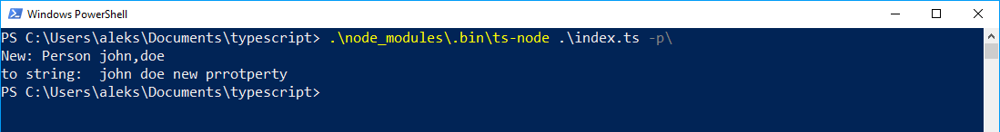
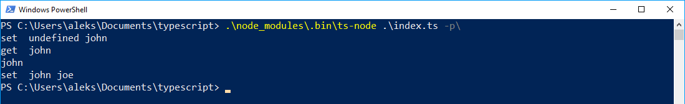
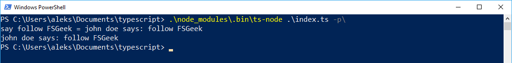
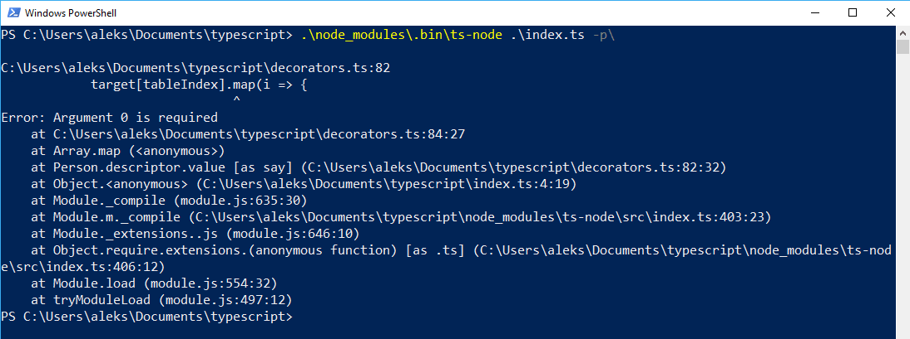

Aktualnie piszę projekt na studiach w Angularze i pierwsza rzecz jaka rzuca się w oczy to obecność charakterystycznych struktur. Są to tak zwane dekoratory, które pozwalają zmieniać zachowanie klasy poprzez dodawanie do nich pewnych elementów lub modyfikacje istniejących. Co najważniejsze nie jest to tylko zarezerwowane dla Angulara i sami możemy stworzyć coś takiego w parę minut.

<!--more-->

## Wzorzec dekoratora

Zanim przejdę do implementacji dekoratorów w TypeScript warto zacząć od tego, że jest to jeden ze strukturalnych wzorców projektowych. Powstał jako alternatywa do typowego dziedziczenia w programowaniu obiektowym. Główna różnica to moment w którym jest wykorzystywany - dziedziczenie odbywa się podczas kompilacji kodu natomiast dekoratory rozszerzają zachowanie klasy podczas działania programu. Wykorzystanie tego wzorca pozwala na skrócenie kodu i poprawienie jego czytelności. 

## Dekoratory w TypeScript

W Typescripcie dekoratory możemy pisać dla naszych stworzonych klas. Istnieją ich 4 rodzaje w zależności od tego gdzie je wykorzystamy: 

- Klasy
- Pola
- Metody 
- Parametru

Każdy z nich jest zwykłą funkcją, która przyjmuje odpowiednie parametry(ich liczba i typ zależą od wykorzystanego dekoratora) i czasami zwraca nową wartość, która nadpisuje to co udekorowaliśmy. Funkcję przypisujemy do odpowiedniego miejsca przy pomocy znaku `@`, który wraz z nazwą funkcji umieszczamy nad deklaracją elementu który chcemy udekorować.

Dziś na potrzeby postu postaram się udekorować prostą klasę `Person`, która wygląda następująco: 

```ts
export class Person {

    firstname: String;
    lastname: String;

    constructor(firstname, lastname) {
        this.firstname = firstname;
        this.lastname = lastname;

    }

    say(text) {
        return this.firstname + " " + this.lastname + " says: " + text;
    }
}
```

Nie wygląda na skomplikowaną i taka miała być. Dwa pola, konstruktor i jedna metoda wystarczają by pokazać możliwości dekoratorów.  Postaram się dodać do każdego elementu logowanie danych w konsoli tak by wiedzieć co się dzieje z klasą.

## Dekorator klasy

Na sam początek, najtrudniejszy według mnie dekorator, który może mocno zmienić zachowanie naszej klasy lub nawet zepsuć jeśli będziemy nieuważni. Jak wspominałem używanie dekoratorów jest proste, co widać poniżej:

```ts
@classLogger
export class Person {
    ...
}
```

Sama funkcja jednak do najprostszych nie należy, co będzie widać przy kolejnych przykładach. Moja wygląda następująco

```ts
const classLogger = (target) => {
    const original = target;

    const construct = (constructor, args) => {
        const c: any = function () {
            this.newProperty = "new prrotperty";
            return constructor.apply(this, args);
        }

        c.prototype = constructor.prototype;
        c.prototype.toString = function () {
            console.log("to string: ", ...args, this.newProperty)
        }

        return new c();
    }


    const newConstructor: any = function (...args) {
        console.log("New: " + original.name + " " + args);
        return construct(original, args);
    }

    newConstructor.prototype = original.prototype;

    return newConstructor;
}
```

Ten dekorator przyjmuje tylko jeden parametr i jest nim konstruktor naszej klasy czyli zwykła funkcja. I to jest to co jesteśmy w stanie tak naprawdę zmienić. Możemy zmienić zachowanie konstruktora, dopisać pewne zachowania a następnie go zwrócić. 
Analizę tej funkcji najlepiej zacząć od dołu. Jako nowy konstruktor zwracamy funkcję o nazwie `newConstructor`. Tuż przed tym mamy na pierwszy rzut oka dziwne przypisanie ale jest ono zrobione tylko po to by poprawnie działał operator `instanceof`. 
W funkcji `newConstructor` wyświetlamy w konsoli interesujące nasz informacje oraz zwracamy funkcję o nazwie `construct`. To jest tak naprawdę najbardziej skomplikowany fragment. Najpierw tworzymy nowy konstruktor i zwracamy w nim wynik uruchomienia konstruktora oryginalnego. Możemy też dodać nowe pola do których mamy potem dostęp. Następnie kopiujemy wszystkie funkcje z naszej klasy. W tym miejscu możemy też dodać dodatkowe funkcje, które nie były w oryginalnej klasie a które możemy wywołać. Jak teraz zwrócimy nową instancję naszej klasy to wszystko będzie działać tak jak powinno. 

```ts
import { Person } from "./decorators";
const a = new Person('john', 'doe');
a.toString();
```



## Dekorator pola

Teraz wchodzimy do wnętrza klasy by zdefiniować logowanie zmian na polu klasy. Tak jak poprzednio dodanie dekoratora jest proste: 

```ts
@propertyLogger
firstname: String;
```

Sama funkcja natomiast wygląda następująco:

```ts
const propertyLogger = (target, key) => {
    let value = this[key];

    const getter = () => {
        console.log('get ', value);
        return value;
    }

    const setter = (newValue) => {
        console.log('set ', value, newValue);
        value = newValue;
    }

    if (delete this[key]) {
        Object.defineProperty(target, key, {
            get: getter,
            set: setter,
            enumerable: true,
            configurable: true
        })
    }
}
```


Wykonuje się ona jednorazowo przy inicjalizacji klasy. Jak widać na pierwszy rzut oka funkcja przyjmuje dwie wartości ale niczego nie zwraca. Sama funkcja nie jest ciężka ale warto zwrócić uwagę na parę rzeczy. Po pierwsze argumenty - pierwszym z nich jest prototyp naszej klasy, natomiast drugim jest nazwa pola, które udekorowaliśmy. I ta nazwa posłuży nam do odnalezienia pola w klasie. Pierwsza dziwna rzecz, która rzuca się w oczy to wykorzystanie operatora `this`. Jednak jak się dokładnie sprawdzi jak działają dekoratory to można zobaczyć, że nasze this odnosi się do klasy więc wykorzystując `this[key]` jesteśmy w stanie pobrać wartość naszego pola. Następnie tworzymy zwykłe funkcje, które logują nam operacje. I cała magia dzieje się na dole funkcji. Najpierw usuwamy oryginalne pole i jeśli to się powiedzie to tworzymy nowe o tej samej nazwie ale ze zdefiniowanymi przez nas getterem i setterem. 

```ts
import { Person } from "./decorators";
const a = new Person('john', 'doe');
console.log(a.firstname);
a.firstname = 'joe';
```



## Dekorator metody

Następny dekorator jest dosyć ciekawy i daje sporo możliwości przy odpowiednim wykorzystaniu. Podobnie jak poprzednio zaaplikowanie go jest proste

```ts
@methodLogger
say(text) {
```

Natomiast sama funkcja wygląda następująco:

```ts
const methodLogger = (target, key, descriptor) => {

    const originalValue = descriptor.value;

    descriptor.value = function (...args) {
        const result = originalValue.apply(this, args);
        console.log(key + " " + args + " = " + result);
        return result;
    }

    return descriptor;
}

```

Tym razem mamy do dyspozycji 3 argumenty: prototyp klasy, nazwę funkcji oraz deskryptory związane z tą funkcją. I to trzeci argument jest nam najbardziej potrzebny przy wszelakich manipulacjach. Na początku zapisuję w dodatkowej zmiennej wartość `value` z tego deskryptora - będzie mi to potrzebne w przyszłości. To pole jest wykorzystywane za każdym razem gdy chcemy pobrać wartość, czyli wywołać funkcję. I w tym miejscu jest ukryta nasza oryginalna funkcja z klasy.
Teraz mogę nadpisać tą wartość za pomocą mojej funkcji. Pierwsze co robię to wywołuję oryginalną funkcję tak by otrzymać poprawny wynik a następnie loguję potrzebne mi informacje. Oczywiście na koniec muszę zwrócić poprawny wynik by użytkownik nie zauważył różnicy w działaniu.

```ts
import { Person } from "./decorators";
const a = new Person('john', 'doe');
console.log(a.say('follow FSGeek'));
```




## Dekorator parametru

No i na sam koniec powiązany niejako z poprzednim dekorator parametru. Zaaplikowanie go nie jest problematyczne

```ts
say(@required text) {
}
```

```ts
const required = (target, key, index) => {
    const tableIndex = `${key}_arguments`
    if (Array.isArray(target[tableIndex])) {
        target[tableIndex].push(index);
    } else {
        target[tableIndex] = [index];
    }

}
```

Wygląda podobnie do poprzedniej, ponieważ też ma 3 argumenty ale trzeci jest dużo uboższy ponieważ zawiera jedynie indeks argumentu w funkcji. Jako pierwszy argument dostajemy znowu prototyp naszej klasy, który możemy wykorzystać do przechywania różnych wartości pomiędzy dekoratorami. W moim przykładzie umieściłem pod odpowiednim kluczem tablicę indeksów parametrów, które chcę by były wymagane podczas wywołania jej. Jednak żeby móc to sprawdzić muszę stworzyć nowy dekorator metody.

```ts
@validate
@methodLogger
say(@required text) {
}
```

```ts
const validate = (target, key, descriptor) => {
    const originalValue = descriptor.value;
    const tableIndex = `${key}_arguments`

    descriptor.value = function (...args) {
        if (target[tableIndex]) {
            target[tableIndex].map(i => {
                if (i > args.length || args[i] == undefined) {
                    throw new Error(`Argument ${i} is required`);
                }
            })
        }

        return originalValue.apply(this, args);
    }

    return descriptor;
}
```

Właściwie kod nie wymaga już wyjaśnienia ponieważ to co jest potrzebne do zrozumienia opisałem wcześniej. W momencie gdy do funkcji zostało przekazanych mniej parametrów niż aktualny indeks wymaganego lub aktualny argument ma wartość `undefined` to wyrzucamy błąd

```ts
import { Person } from "./decorators";
const a = new Person('john', 'doe');
console.log(a.say(undefined));
```



Jak widać z wykorzystaniem dekoratorów i odrobiną wyobraźni możemy osiągnąć bardzo dużo. Warto zauważyć do dodanie ich do klasy jest bezproblemowe i możemy zrobić to w dowolnym momencie i nie będzie się to wiązało z dodatkowymi problemami. Warto też rozważyć je jako opcja do walidowania danych, tworzenia efektów pobocznych lub jak to pokazałem w poście do logowania różnych informacji. Właściwe i mądre wykorzystanie może polepszyć nasz kod dzięki wydzieleniu funkcji i zostawienie w funkcjach "czystego mięsa" :D


