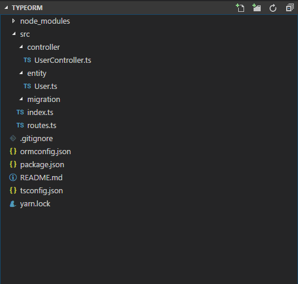
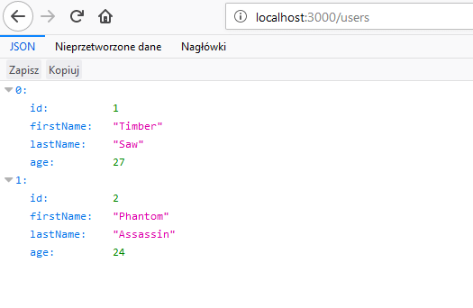

Ostatnio pisałem o tym jak można się połączyć z bazą danych w Node.js(wpis możecie przeczytać [tutaj](https://fsgeek.pl/post/node-mysql/)). Jednak w prawdziwych projektach rzadko kiedy korzystamy z takich czystych połączeń, a częściej ze specjalnych bibliotek ORM. Dla Node.js został stworzyny TypeORM o którym dziś napisałem.

<!--more-->

## ORM

Zanim przejdę do samej biblioteki warto powiedzieć co to jest ten cały ORM dla osób, które pierwszy raz się z tym stykają. ORM czyli Object-Relational Mapping (po polsku ma wdzięczną nazwę Mapowanie Obiektowo-Relacyjne) jest sposobem w jaki możemy przekształcić nasz model danych na to co mamy w bazie danych, dzięki czemu podczas pracy w naszym systemie możemy niejako zapomnieć o bazie danych i korzystać tylko z naszych klas. Jest to bardzo popularne rozwiązanie i znajdziemy biblioteki ORM w każdym języku. TypeORM jest wzorowany między innymi na Hibernate z Javy i Doctrine z PHP, więc jeśli coś w nich kiedyś robiliście to poczujecie się jak w domu. A dla całej reszty przejdziemy po ważniejszych elementach

## Instalacja i pierwsze kroki w TypeORM

Osobiście jestem fanem wszystkich narzędzi CLI, ponieważ ułatwiają pracę i pozwalają zaoszczędzić czas na nudnych elementach naszej pracy. O ile można korzystać z takich narzędzi to robię z nich użytek i również do tego zachęcam. TypeORM na szczęście też ma taką możliwość i możemy z niej skorzystać instalując globalnie bibliotekę 

```console
yarn global add typeorm
```

Teraz mając narzędzie możemy stworzyć nowy projekt za pomocą jednego polecenia

```console
typeorm init --name typeorm --database mysql --express
```

Ja wybrałem bazę MySQL ponieważ mam już serwer postawiony do niej ale TypeORM wspiera oprócz niej jeszcze  MariaDB, Postgres, SQLite,  Microsoft SQL Server, Oracle, sql.js oraz MongoDB. Oprócz bazy danych dodatkowo wybrałem, że chcę korzystać z Express.js. 

Po wygenerowaniu projektu przy pomocy tej komendy nie możemy zapomnieć o tym by zainstalować wszystkie potrzebne biblioteki.

Zanim zaczniemy tworzyć nasze rozwiązania warto przejrzeć wszystkie pliki by zobaczyć co się w nich kryje by nie być zaskoczonym. Wygenerowane drzewo plików nie należy do dużych ale zawiera też przykładową encję, którą dziś sobie omówimy.



Ważniejsze pliki na które warto zwrócić uwagę to UserController, User, index, routes i ormconfig. Pierwsze co warto sprawdzić to plik index.ts gdzie czeka na nas pewna niespodzianka. Otóż na dole pliku znajdziemy taki fragment kodu

```ts
// insert new users for test
await connection.manager.save(connection.manager.create(User, {
	firstName: "Timber",
	lastName: "Saw",
	age: 27
}));
await connection.manager.save(connection.manager.create(User, {
	firstName: "Phantom",
	lastName: "Assassin",
	age: 24
}));

```

Jest on w porządku ponieważ dodaje nam na początek dane testowe do tabeli - o ile o nim wiemy i go usuniemy potem. Ponieważ jest położony w pliku indeks.js obok metod które tworzą serwer expressa to zostanie wykonany za każdym razem jak uruchomimy naszą aplikację. Jeśli o tym zapomnimy to możemy się zdziwić ;) 

## Konfiguracja połączenia

Najważniejszy plik, który potrzebujemy aby uruchomić naszą aplikację to `ormconfig.json`. Zawiera on konfigurację, która pozwoli się zalogować do bazy danych oraz parę dodatkowych opcji. 

```json
{
   "type": "mysql",
   "host": "localhost",
   "port": 3306,
   "username": "root",
   "password": "",
   "database": "typeorm",
   "synchronize": false,
   "logging": false,
   "entities": [
      "src/entity/**/*.ts"
   ],
   "migrations": [
      "src/migration/**/*.ts"
   ],
   "subscribers": [
      "src/subscriber/**/*.ts"
   ],
   "cli": {
      "entitiesDir": "src/entity",
      "migrationsDir": "src/migration",
      "subscribersDir": "src/subscriber"
   }
}
```

Również na początku zmieniłem wartość `synchronize` na `false`. Przed tym przy każdym uruchomieniu serwera baza danych była synchronizowana z naszymi encjami. Znaczy to tyle że w bazie były wykonywane operacje tak by synchronizacja była możliwa czyli dodawanie i usuwanie tabeli, dodawanie kolumn, usuwanie ich czy też zmiana nazw. Jak dla mnie jest to niepożądane gdyż możemy sobie łatwo zepsuć nasze dane w najmniej oczekiwanym momencie.


## Migracje 
Dużo lepszym rozwiązaniem jest tworzenie tzw.: plików migracji, które zawierają kolejno wprowadzane zmiany do bazy danych. Mamy dzięki temu historię kolejnych zmian do bazy i jest wtedy łatwiej naprawić błędy w momencie gdy któraś zmiana wprowadziła problemy do systemu. Należy pamiętać, że jeśli wyłączyliśmy opcję `synchronize` to przed pierwszym uruchomieniem aplikacji musimy wykonać migrację co pozwoli stworzyć początkową strukturę bazy danych. 

Aby wygenerować taką migracje możemy wykorzystać polecenie: 

```console
typeorm migration:generate -n User
```

Jednak zapewne u was nie zadziała ponieważ wyrzuci błąd składni. Po kilku próbach doszedłem do działającej u mnie wersji, która wygląda następująco: 

```console
./node_modules/.bin/ts-node .\node_modules\typeorm\cli.js migration:generate -n User
```

Jednak zapis jest strasznie długi więc dla wygody wrzuciłem polecenie do pliku `package.json`

```json
"cli": "ts-node ./node_modules/typeorm/cli.js"
```

Teraz można wykonywać te komendy w skróconej formie

```console
yarn cli migration:generate -n User
```

Po użyciu ten komendy zobaczmy że w katalogu `migrations` pojawił się nowy plik, który wygląda następująco: 

```ts
import {MigrationInterface, QueryRunner} from "typeorm";

export class User1526735542526 implements MigrationInterface {

    public async up(queryRunner: QueryRunner): Promise<any> {
        await queryRunner.query("CREATE TABLE `user` (`id` int NOT NULL AUTO_INCREMENT, `firstName` varchar(255) NOT NULL, `lastName` varchar(255) NOT NULL, `age` int NOT NULL, PRIMARY KEY (`id`)) ENGINE=InnoDB");
    }

    public async down(queryRunner: QueryRunner): Promise<any> {
        await queryRunner.query("DROP TABLE `user`");
    }

}
```

Widzimy tu klasę z dwoma metodami `up` i `down`. Up jest wykorzystywane w momencie gdy aplikujemy migracje czyli zawiera zmiany jakie zostaną wykonane na bazie by dostosować ją do aktualnego stanu encji. Natomiast `down` wykorzystujemy gdy chcemy cofnąć zmiany bo zrobiliśmy coś co zepsuło bazę w pewien sposób. 

Aby zaaplikować zmiany do bazy danych musimy użyć kolejnego polecenia :

```console
yarn cli migration:run
```


Zostaną odpalone wszystkie migracje, które do tej pory nie zostały zaaplikowane dla bazy danych. Możecie spytać skąd CLI wie jakie migracje odpalić a jakie pominąć by nie doszło do duplikacji? Otóż w bazie danych jest specjalna tabela która zawiera nazwy oraz timestamp wszystkich uruchomionych do tej pory migracji. I wystarczy że sprawdzi jaki timestamp ma ostatni wpis w tabeli i uruchomi wszystkie starsze migracje.

Skoro już mamy zsynchronizowane encje z bazą danych to możemy uruchomić aplikację poleceniem:

```console
yarn start
```

Jeśli wszystko się powiedzie i wejdziemy na podany w konsoli adres to zobaczymy dwa przykładowe wpisy w bazie



## Encje

Najważniejszye pliku w całym TypeORM o których do tej pory tylko wspominałem to nasze pliki encji. To one tworzą naszą bazę danych i decydują o tym jak się dostaniemy do danych. Dziś zajmiemy się tylko sprawdzeniem co zostało dla nas wygenerowane a dostaliśmy coś takiego: 

```ts
@Entity()
export class User {

    @PrimaryGeneratedColumn()
    id: number;

    @Column()
    firstName: string;

    @Column()
    lastName: string;

    @Column()
    age: number;

}

```

Widzimy tutaj bardzo ładny przykład wykorzystania klas i dekoratorów. Jest to chyba najłatwiejszy sposób by stworzyć i skonfigurować nową encję. Pierwsze co musimy zrobić to umieścić dekorator `@Entity()` nad klasą. Będzie to informacja, że tą klasę trzeba przekształcić w tabelę w bazie danych. Każda tabela musi posiadać kolumny w których będą przechowywane dane dla poszczególnych rekordów. Robimy to oznaczając pole w klasie dekoratorem `@Column()`. Oczywiście każdy rekord musi mieć swój klucz główny czyli specjalną kolumnę (lub grupę kolumn), która pozwala jednoznacznie rozróżnić zidentyfikować rekord. Ustawiamy to dając dekorator `@PrimaryColumn()` przy czym wtedy musimy sami zadbać o wstawianie unikalnych identyfikatorów. Jeśli chcemy by generowały się same to możemy zamienić powyższy dekorator na `@PrimaryGeneratedColumn()` jak to jest w naszej encji.

## Entity Repository

OK, to mamy naszą encję, wiemy jak wygenerować migracje by nałożyć zmiany na bazę danych ale jak teraz operować na danych w bazie? Chyba nie musimy pisać własnych kwerend? Na szczęście nie, ponieważ możemy wykorzystać repozytorium encji. Repozytorium encji jest specjalnym rodzajem menadżera encji ponieważ jest ograniczony tylko do jednej wybranej przez nas encji. Pozwala na wykonywanie wszystkich podstawowych operacji na bazie danych przy pomocy specjalnie do tego stworzonych metod. Najlepiej to zobaczyć na przykładzie : 

```ts
private userRepository = getRepository(User);
```

Najpierw musimy pobrać repozytorium dla danej encji. W ten sposób mamy pewność, że cokolwiek robimy to będzie wykonywane na pojedynczej tabeli w bazie. Mając takie repozytorium możemy skorzystać z kilku predefiniowanych metod: 

```ts

    this.userRepository.find({id: 1});

    this.userRepository.findOne(request.params.id);
    
    const user = await this.userRepository.findOne(request.params.id)
    this.userRepository.remove(user);
    
    this.userRepository.save({
            firstName: "Timber",
            lastName: "Saw",
            age: 27
        });

```

Tak naprawdę niewiele jest tutaj do tłumaczenia gdyż nazwy same wskazują co robią. Ciekawa jest opcja `find()` ponieważ domyślnie zwraca wszystkie rekordy w danej tabeli ale możemy jako parametr przekazać obiekt np.: `{id: 1}` i wtedy zwróci tylko rekordy dla których jest spełniony ten warunek.  Podobnie działa `findOne`, który zwróci tylko jeden rekord - jeśli szukamy po kluczu podstawowym to możemy po prostu wstawić klucz jako argument funkcji tak jak to widać wyżej, ale możemy również przekazać obiekt jak w przypadku metody `find`. 

