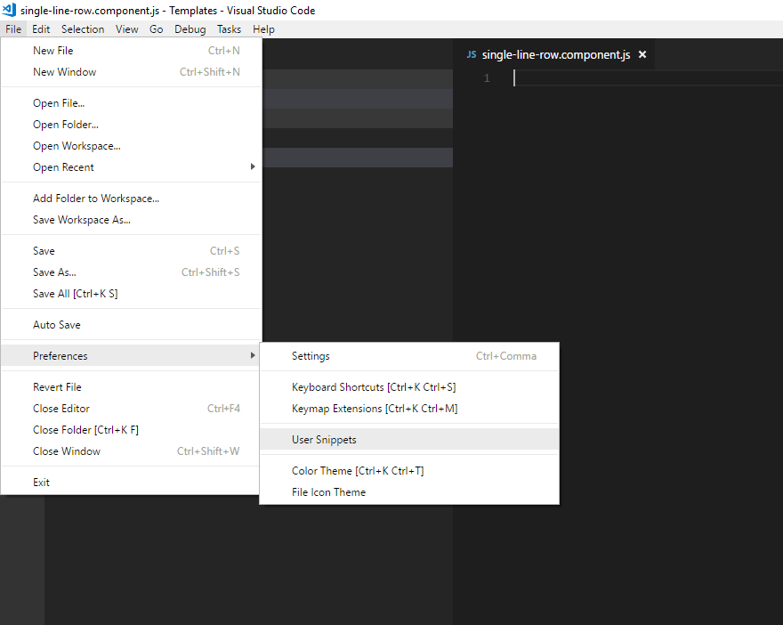
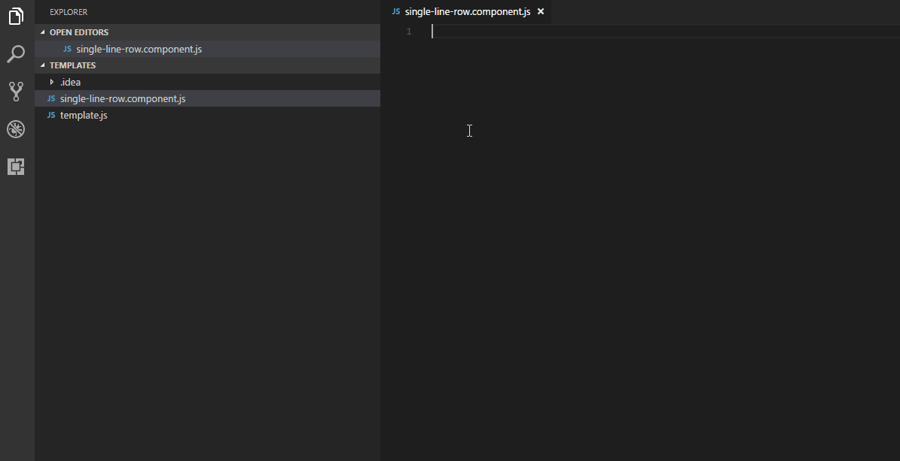

Poprzedni wpis z tej serii dotyczący [szablonów w Intelijj](https://fsgeek.pl/post/intellij-szablony/) cieszył się sporą popularnością więc postanowiłem spojrzeć jakie mamy możliwości w darmowych edytorach. Jako pierwszy wybrałem Visual Studio Code którego używam do mniejszych zadań kiedy nie potrzebuję całego IDE. 

<!--more-->

## Snippety w Visual Studio Code

W edytorze od firmy Microsoft nie mamy możliwości tworzenia szablonów plików jednak jesteśmy w stanie tworzyć snippety, które działają identycznie jak live templates z produktów Intelijj. Trochę inaczej je definiujemy ale nie na tyle by nie dało się tego zrobić ;) 

Aby stworzyć własny snippet musimy kolejno wybrać: __File->Preferences->User Snippets__ . 



Otworzy nam się okno gdzie musimy wybrać język dla którego tworzymy (czyli w moim przypadku Javascript)


Po wybraniu języka dla naszego snippetu otworzy nam się plik `.json` w którym u góry w komentarzu widnieje krótka instrukcja jak stworzyć własny snippet oraz jeden przykładowy. 

```
"Print to console": {
        "prefix": "log",
        "body": [
            "console.log('$1');",
            "$2"
        ],
        "description": "Log output to console"
    }
```

Składa się on z kilku części:

- "Print to console" - nazwa naszego snippetu
- prefix - słowo lub zbiór znaków które po wpisaniu w pliku i naciśnięciu tab mają się przekształcić w kod
- Body - część właściwa czyli kod który ma się pojawić 
- Description - krótki opis co właściwie snippet robi

Wygląda prosto jednak radzę się przyjrzeć sekcji body. Przyjmuje ona tylko stringa lub tablicę stringów więc jeśli chcemy mieć w sekcji body kod składający się z wielu linijek to musimy opakować to w tablicę i każdą linię jako osobny element w tej tablicy. Jest to strasznie niewygodne w stosunku do narzędzi Intelijj. Widziałem już zgłoszenia od innych ludzi na githubie by zostało to poprawione by można było tego używać w bardziej ludzki sposób. Mam nadzieję, że przyniesie to zmianę w przyszłości. Do tego czasu polecam ten [codepen](https://codepen.io/mrmlnc/pen/GqrqPg) gdzie można zmienić swój kod tak by można go było wstawić do sekcji body.

## React Component snippet

Podobnie jak w poprzednim wpisie pokażę jak można wykorzystać mechanizm snippetów na przykładzie możliwości szybkiego stworzenia komponentu w Reactcie. Mój kod wygląda następująco: 

```
"react-component":{
        "prefix": "rc",
        "body": [
            "// @flow",
            "import React, {Component} from 'react'",
            "",
            "export class ${1:${TM_FILENAME_BASE/^(.)|-(.)|\\.(.)/${1:/upcase}${2:/upcase}${3:/upcase}/g}} extends Component{ ",
                "\trender(){",
                    "\t\treturn(",
                        "\t\t\t<div></div>",
                    "\t\t)",
                "\t}",
            "}"
        ],
        "description": "React component"
    }


```

Właściwie nie wymaga to wiele wyjaśnień oprócz ciągu znaków które stoją w miejscu nazwy komponentu:

```
${1:${TM_FILENAME_BASE/^(.)|-(.)|\\.(.)/${1:/upcase}${2:/upcase}${3:/upcase}/g}}

```

Ten kawałek pozwala na zamianę nazwy pliku (bez rozszerzenia) na PascalCase. Jest to druga niedogodność w stosunku do Intelijj. Aby dokonywać trasformacji zmiennych (tutaj `TM_FILENAME_BASE`) możemy wykorzystać jedynie wyrażenia regularne które znajdą nam pewne grupy w nazwie a następnie trasformacja tych grup (na przykład zamiana na dużą literę: `upcase`). Na pierwszy rzut oka jest to trochę nieczytelne ale da się przyzwyczaić i można się dodatkowo poduczyć wyrażeń regularnych. Może w przyszłości pojawi się parę najczęściej wykorzystywanych funkcji jak to było w produktach Intelijj. Na szczęście po stworzeniu snippeta jego wykorzystywnanie jest już proste :)



Jeśli podobał wam się wpis to udostępnijcie go by inni też go znaleźli, polajkujcie fanpage  [FSGeek](https://www.facebook.com/fsgeekk/) na Facebook'u. Napiszcie również w komentarzach jakich innych edytrów używacie i o jakich rzeczach chcielibyście jeszcze poczytać :)  


