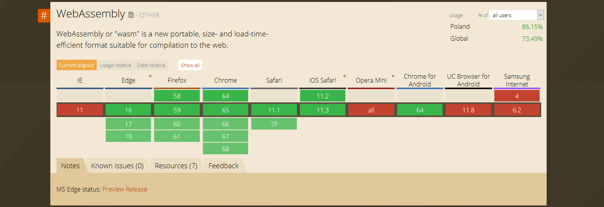
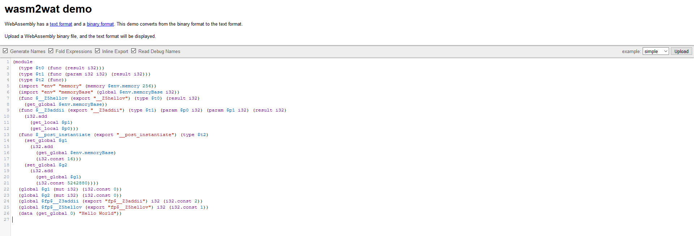

Jedną z technologii, która będzie się rozwijać w tym roku jest WebAssembly. Póki co pojawia się dosyć nieśmiało ale coraz częściej. Według mnie wprowadzi małą rewolucję w sposobie jaki piszemy aplikacje internetowe w przyszłości. Dziś postanowiłem sprawdzić jak i czy możemy się nim już teraz pobawić.

<!--more-->

## Co to jest WebAssembly?

Zanim zaczniemy coś w tym robić warto wiedzieć co to w ogóle jest. WebAssembly jest nowym sposobem pisania aplikacji dla współczesnych przeglądarek internetowych. Jest to otwarty standard rozwijany przez [WebAssembly Working Group](https://www.w3.org/wasm/). Wśród jego członków są przedstawiciele największych firm technologicznych takich jak Apple, Google, Microsoft, Mozilla co pozwala mieć nadzieję, że nie będzie problemów z kompatybilnością nowego standardu z przeglądarkami. Już teraz jest z tym nieźle ponieważ według strony CanIUse wszyscy główni gracze pozwalają na uruchomienie kodu WebAssembly. 

WebAssembly albo jak się go w skrócie określa Wasm został napisany nie tyle jako nowy język, którego będzie się trzeba uczyć ale jako sposób kompilacji istniejących programów w C, C++, Rust tak aby dało się je odpalić w przeglądarce z ich natywną szybkością. Taki gotowy moduł jesteśmy w stanie zaimportować do przeglądarki w kodzie Javascript i następnie wykorzystywać natywnie napisane funkcje. Brzmi super, co nie?  

## Jak rozpocząć z tym pracę?

O teorii najczęściej mówi się łatwo to z praktyką jest problem. Zasada działania WebAssembly jest banalnie prosta: bierzemy kawałek kodu w C, kompilujemy go do pliku *.wasm i importujemy w kodzie Javascript. Jednak jak się okazuje diabeł tkwi w szczegółach. Zacznijmy w takim razie od początku. Tak jak napisanie prostego kodu w C/C++ nie jest problematyczne to jak go skompilować do odpowiedniego pliku? Póki co współczesne kompilatory nie pozwalają na kompilację do tego formatu (chyba, że coś ominąłem to będę wdzięczny za wskazanie takiego co to potrafi :) ) ale mamy inne narzędzia.  Jedną z opcji jest wykorzystanie narzędzia online, które pozwala napisać kod w C/C++, następnie skompilowanie i ściągnięcie właściwego pliku *.wasm - jeśli was to zainteresowało to znajdziecie go [tutaj](https://mbebenita.github.io/WasmExplorer/). 

Drugą opcją jest wykorzystanie odpowiedniego narzędzia na systemie w którym pracujemy.  Aktualnie polecanym jest [emsdk](https://github.com/juj/emsdk), który jest polecany na stronie poświęceonej [Webassembly](http://webassembly.org) i pozwala na kompilację z lini poleceń pliku *.c i *.cpp do *.wasm. Nie będę zanudzał was sposobem instalacji tego skryptu jako, że wszystko jest fajnie opisane na githubie. Przejdzemy za to do tego co tygryski lubią najbardziej czyli kodu.

## Pierwsza funkcja

Czas coś napisać w końcu. Na sam początek prosta funkcja która zwraca wynik dodania do siebie dwóch liczb. Jednym słowem banał


int add(int a, int b){
	return a+b;
}


Żeby coś takiego skompilować musimy w konsoli wpisać takie polecenie 

em++ helloworld.cpp -Os -s WASM=1 -s SIDE_MODULE=1 -s ONLY_MY_CODE=1 -o helloworld.wasm


Dzięki takiemu dobraniu przełączników powstaje minimalny plik *.wasm który zawiera tylko to co jest potrzebne. Warto wykorzystywać narzędzie [wasm2wat](https://cdn.rawgit.com/WebAssembly/wabt/aae5a4b7/demo/wasm2wat/), które pozwala podejrzeć zawartość tego pliku w postaci tekstowej. Dla mojego pliku wygląda on następująco

Szczególnie warto zerknąć na linie 4 i 5 ponieważ za chwilę będą nam potrzebne. 

Teraz wszystko co trzeba zrobić to zaimportować ten plik w naszym kodzie Javascript. Aktualnie wymaga to trochę kodu ale są plany by w przyszłości można było importować te modułu przy wykorzystaniu taga `<script type='module'>` (a i mam nadzieję że zwykłe `import … from..` będzie działać). Aktualnie by wywołać naszą funkcję z C w przeglądarce musimy wykonać parę kroków: 

- bierzemy plik *.wasm i wsadzamy go do `ArrayBuffer`
- taką tablicę następnie kompilujemy  do WebAssembly.Module()
- i na sam koniec tworzymy instancje takiego modułu przekazując tam odpowiedni obiekt `imports` i otrzymując w zamian wyeksportowane funkcje

Opis trochę długi ale w kodzie nie wygląda to najgorzej


const imports = {
    env: {
        memoryBase:0,
    }
  };

function loadWebAssembly(fileName) {
  return fetch(fileName)
  .then(response => response.arrayBuffer())
  .then(bytes => WebAssembly.compile(bytes)
  .then(m => new WebAssembly.Instance(m, imports)))
};

loadWebAssembly('helloworld.wasm')
  .then(instance => {
    add = instance.exports.__Z3addii;

    console.log(add(5,2)); // 7
});



Parę słów wyjaśnienia co do kodu. Obiekt `imports` został stworzony na podstawie tego co było w pliku *.wat w linii 4. Również dziwna jest nazwa funkcji, którą pobieram z obiektu `exports`. Dostała dodatkowy prefix i sufix do nazwy którą nadaliśmy w pliku *.cpp. To jaką nazwę dostanie moja funkcja sprawdziłem w linii 5. 

## Hello World
Dlaczego jednak nie zrobiłem, jak to jest w zwyczaju, funkcji, która zwróci napis `Hello World`. Ponieważ okazuje się, ze jest to troszkę bardziej skomplikowane. WebAssembly posługuje się typami liczbowymi stało- i zmiennopozycyjnymi. Oznacza to, że nie możemy bezpośrednio z funkcji zwrócić `stringa` ale nie jest to też niemożliwe. Podobnie jak wyżej stwórzmy najpierw funkcję w C++, która zwróci nam nasz upragniony napis


const char * hello() {
  return "Hello World";
}


Po skompilowaniu tego identycznym wyrażeniem co powyżej warto sprawdzić jak wygląda w pliku *.wat. 

Ważne by zauważyć, że w linii 5 pojawił się wpis dotyczący potrzeby umieszczenia w obiekcie `imports` elementu `memory`. Okazuje się że stringi w WebAssembly są zwracane w pamięci.  Więc po co nam wyeksportowana funkcja `__Z5hellov`? Ponieważ funkcja w tym przypadku zwraca indeks początku naszego napisu w pamięci. Od tego momentu musimy przechodzić po tablicy aż napotkamy element równy `0` czyli `NULL` w tablicy ASCII. Również jeśli mamy kilka funkcji które zwracają stringi będą one umieszczone po kolei w pamięci odzielone od siebie pojedynczą wartością `0`.


const imports = {
    env: {
        memoryBase:0,
        memory: new WebAssembly.Memory({
          initial: 256
        }),
    }
  };

...

 loadWebAssembly('helloworld.wasm')
  .then(instance => {
    hello = instance.exports.__Z5hellov;
    const memoryArr = new Uint8Array(imports.env.memory.buffer)
    
    let i = hello();
    let response = '';
    while(memoryArr[i]){
      response = response + String.fromCharCode( memoryArr[i] )
      i++;
    }

    console.log(response); // Hello World
}); 


Przykład jak można wyciągnąć nasz napis z pamięci jest pokazany na dole kodu. Najpierw zamieniam obszar pamięci w tablicę po której mogę następnie iterować. Dodatkowo wykorzystuję metodę `fromCharCode` żeby zamienić kod ASCII na odpowiedni string.

Trzeba przyznać, że wygląda to obiecująco. Jeśli będzie się cały czas rozwijać to może się okazać że za chwilę będziemy ściągać paczki z npm, które będą mieć moduły w WebAssembly. Jest nadzieja, że będzie to działało szybciej niż standardowy JS. Oczywiście nie zastąpi to Javascriptu ale może zmienić sposób w jaki go wykorzystujemy. Przyszłość zapowiada się ciekawie. 

