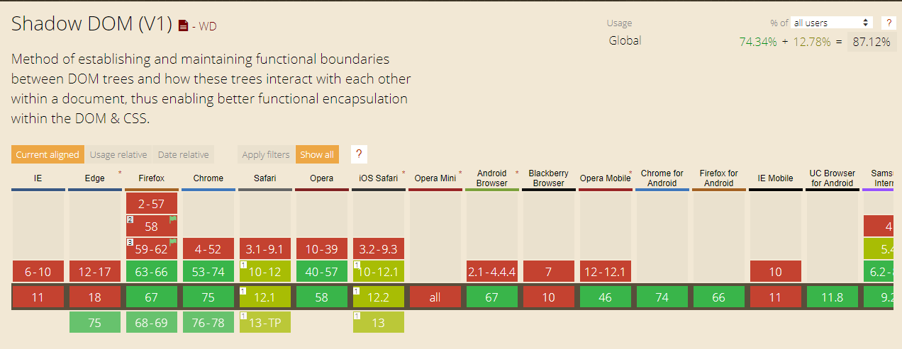
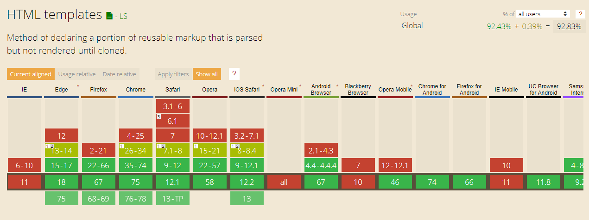

Za co tak bardzo lubimy biblioteki typu React lub całe frameworki jak Angular? W moim przypadku jest to możliwość tworzenia komponentów, zamykania w nich części logiki a następnie wielokrotne wykorzystywanie ich w aplikacji. Ale czy jest to domena tylko dodatkowych bibliotek? A może da się to zrobić w czystym JavaScriptcie i HTML'u? Okazuje się, że tak. Od jakiegoś czasu możemy tworzyć własne komponenty w przeglądrce przy pomocy Web Components.

<!--more-->

## Komponenty ponad wszystko
Zanim przejdę bezpośrednio do tego czym są Web Componenty i po co są nam one w ogóle potrzebne to zatrzymajmy się na chwilę przy pojęciu samych komponentów. Ja przez to określenie rozumiem pojedynczy element, który posiada swoją reprezentację na stronie internetowej oraz posiadający pewną logikę, która nim steruje. Po co nam są komponenty podczas tworzenia aplikacji? Po pierwsze pomagają nam utrzymywać czysty kod w którym nie mamy zbędnych powtórzeń - można o tym myśleć jak o odpowiedniku enkapsulacji z programowania obiektowego. Po drugie jak będziemy konsekwentni to tworzenie aplikacji sprowadzi się do wybiera odpowiednich klocków(komponentów) i łączenia ich między sobą. Po trzecie i ostatnie jeśli będziemy musieli wykonać zmianę to zrobimy ją w jednym miejscu.

## Czym są Web Components?
Web Component jest nazwą dla zbioru standardów, które umożliwiają pisanie komponentów bez konieczności korzystania z innych bibliotek. Do tych standardów należą: `Custom elements`, `Shadow DOM`, `HTML Templates`.
Po co w ogóle to rozwiązanie? Nie możemy tworzyć aplikacji przy pomocy React, Vue, Angulara czy innych bibliotek? No możemy, tylko jesteśmy wtedy związani z konkretnym rozwiązaniem. Nie możemy przenieść bezpośrednio komponentu z jednej biblioteki do drugiej np.: z Reacta do Angulara. Natomiast Web Components jak już wspomniałem działają natywnie w przeglądarkach dając nam możliwość tworzenia własnych elementów, które będziemy w stanie zawsze uruchomić niezależnie od innych bibliotek. Jedynie co może nas ograniczać to wsparcie dla tych 3 standardów w przeglądarkach. Jak na dzień dzisiejszy wygląda to wsparcie?






Jak widać nie jest najgorzej chociaż mogłoby być lepiej. Nie mogę doczekać się aż w końcu wyjdzie stabilna wersja Edga na Chromium i wszystkie główne przeglądarki nie będą czerwone.

## Elementy składowe Web Components

Jak już wspomniałem na Web Components składają się 3 standardy. Tak więc aby zrozumieć Web Components to musimy zrozumieć wszystkie składowe: 

- `Custom Elements` - jest to API, które jak sama nazwa wskazuje pozwala na tworzenie własnych elementów, które następnie możemy umieścić w drzewie DOM. Możemy rozróżnić dwa rodzaje elementów: samoistne oraz dostosowanie już istniejących elementów. Różnią się one sposobem deklaracji oraz potem wykorzystania

Samoistne 

```js
class ExpandingList extends HTMLElement {
}
Window.customElements.define('expanding-list', ExpandingList);

```

```html
<exapanding-list></exapanding-list>

```


Dostosowanie istniejących
```js
class ExpandingList extends HTMLUListElement {
}
Window.customElements.define('expanding-list', ExpandingList, { extends: "ul" });

```
	
```html
<ul is="expanding-list"></ul>
```

Z racji tego, że nie wszystkie przeglądarki dają możliwość dostosowywania istniejących elementów to dalej będę wykorzystywać samoistne.

- `Shadow DOM` - wszyscy wiemy czym jest DOM - struktura drzewiasta, która posiada w węzłach różne elementy, które potem wyświetlają się na stronie. Shadow DOM rozszerza tę koncepcję o możliwość dodawania do tych węzłów tzw. Shadow tree (można o tym myśleć jako podstawieniu pod węzeł nowego drzewa). Dlaczego to jest takie fajne? Ponieważ jesteśmy w stanie manipulować elementami wewnątrz Shadow Tree z poziomu naszego drzewa DOM ale nic co jest wewnątrz Shadow DOM nie będzie wpływać na elementy na zewnątrz - idealny przykład to reguły stylowania.
- `HTML Templates` - jest to tak naprawdę nowy element, który pozwala na definiowanie struktury HTML. Wszystko co jest wewnątrz tego znacznika nie będzie wyrysowane na stronie dopóki nie zostanie umieszczone w drzewie DOM przy pomocy kodu JavaScript


## Etapy budowania własnego komponentu
1. Stwórz przy pomocy elementu `template` szablon swojego komponentu - umieść wszystkie potrzebne pola oraz ostyluj tak jak chciałbyś by to wyglądało 
2. Stwórz klasę twojego komponentu, która będzie dziedziczyć po klasie `HTMLElement`
3. W konstruktorze tej klasy dodaj nowe drzewo Shadow DOM i następnie podepnij pod niego zawartość szablonu
4. Zarejestruj nowy element
5. Rozszerzaj swoją klasę o dodatkową logikę 

## Przykładowy komponent

No to mając gotowy przepis czas coś napisać.  Jako, że będzie to mały komponent, zapiszę wszystkie potrzebne elementy w jednym pliku. A co będziemy tworzyć? Prosty komponent zawierający pole tekstowe - coś co każdy już widział i idealnie nadaje się jako komponent z którego potem można tworzyć większe formularze. Tak więc najpierw punkt pierwszy - szablon komponentu 

```js
const template = document.createElement('template');

template.innerHTML = `
<style>
    .input-container {
        display: flex;
        flex-direction: column;
    }

    .error-label {
      color: red;
    }
</style>
<div class='input-container'>
<label>Default label</label>
<input name='default'/>
<div class='error-label'></div>
</div>
`
```

Jak widać komponent jest prosty i taki też miał być. Chciałbym pokazać, że nie potrzebujemy bardzo skomplikowanych rzeczy i nawet proste elementy warto przenieść do Web Components. Tutaj mamy tak naprawdę standardowy zestaw elementów jakie występują dla pojedynczego pola w formularzu - pole tekstowe,  etykieta do tego pola i miejsce na ewentualne błędy. 

Dalej jest punkt drugi czyli stworzenie klasy, która będzie obsługiwała logikę komponentu. 

```js
class Input extends HTMLElement {
    constructor(){
        super();
    }
}

```

Dalej w konstruktorze musimy stworzyć nowe drzewo Shadow DOM.

```js
constructor(){
    super();
    this._shadowRoot = this.attachShadow({ 'mode': 'open' });
    this._shadowRoot.appendChild(template.content.cloneNode(true));
}
```

Tutaj jedyna rzecz jaka wymaga wyjaśnienia to tryb w jakim tworzymy nasze drzewo DOM. Mamy tutaj dwie opcje do wyboru:

- Open - jesteśmy w stanie dostać się do elementów Shadow DOM przy pomocy JavaScript spoza tego elementu. Czyli, innymi słowy, będziemy mogli manipulować elementami wewnątrz Shadow DOM z poziomu głównego drzewa DOM.
- Close - tutaj jest sytuacja odwrotna - nie jesteśmy w stanie dostać się do elementów Shadow DOM z zewnątrz

No i został ostatni element do zrobienia czyli zarejestrowanie naszego elementu. Tutaj kolejne ograniczenie, które trzeba spełnić czyli nazwa naszego elementu musi zawierać myślnik. 

```js
window.customElements.define('input-text', Input);
```

W tym miejscu mamy już nasz własny komponent gotowy, który możemy wykorzystać. Aby to zrobić musimy najpierw zaimportować nasz skrypt a następnie wykorzystać nasz nowy tag.

```html
<input-text></input-text>
```

Tutaj ważna uwaga nie możemy zrobić tego jako samozamykający element - jest ich ograniczona ilość w specyfikacji więc musimy się zadowolić takim zapisem. Właściwie tutaj mógłbym zakończyć ale ten komponent nie jest jeszcze zbyt funkcjonalny. Żeby dało się go dalej używać potrzebujemy edytować parę elementów - etykietę, tekst dla błędu, nazwę pola i wartość domyślną. Możliwość edytowania tych elementów dodam przy pomocy atrybutów - tak żeby wyglądało to podobnie jak w Reactcie. Jak to będzie wyglądało w kodzie?

```js
connectedCallback() {
    const name = this.getAttribute('name');
    const error = this.getAttribute('error');    
    const value = this.getAttribute('value');  
    const label = this.getAttribute('label');  

    const input = this._shadowRoot.querySelector('input')
    input.setAttribute('name', name);
    
    this._shadowRoot.querySelector('.error-label').innerText = error;
    
    if(value)
        input.setAttribute('value', value);
    
    if(label)
        this._shadowRoot.querySelector('label').innerText = label;
}
```


`connectedCallback` jest jedną z metod dotyczących cyklu życia komponentu - ta jest uruchamiana w momencie gdy nasz komponent został umieszczony w drzewie DOM - taki odpowiednik componentDidMount() z Reacta. Reszta kodu jest w miarę oczywista - pobieramy wartości przy pomocy `getAttribute`, następnie wyszukujemy odpowiedni element w drzewie Shadow DOM i umieszczamy tam naszą wartość.  

Całość kodu i wynik możecie zobaczyć na `Codepen`. Komponent nie jest za ładny ale nie oto tutaj chodzi. Mając jeden komponent, który będzie używany w wielu miejscach zmiana wyglądu nie jest problemem :) 

<p class="codepen" data-height="357" data-theme-id="0" data-default-tab="js,result" data-user="Feridum" data-slug-hash="rEeBYa" style="height: 357px; box-sizing: border-box; display: flex; align-items: center; justify-content: center; border: 2px solid; margin: 1em 0; padding: 1em;" data-pen-title="Web Component - POC">
  <span>See the Pen <a href="https://codepen.io/Feridum/pen/rEeBYa/">
  Web Component - POC</a> by Aleksander (<a href="https://codepen.io/Feridum">@Feridum</a>)
  on <a href="https://codepen.io">CodePen</a>.</span>
</p>
<script async src="https://static.codepen.io/assets/embed/ei.js"></script>


I jak wam się podobają Web Components? Korzystacie z tego? Chętnie bym poczytał opinie oraz wnioski po pracy z tym w prawdziwym projekcie. Jakie problemy napotkaliście i czy było coś co chcieliście zrobić a się nie dało? 
